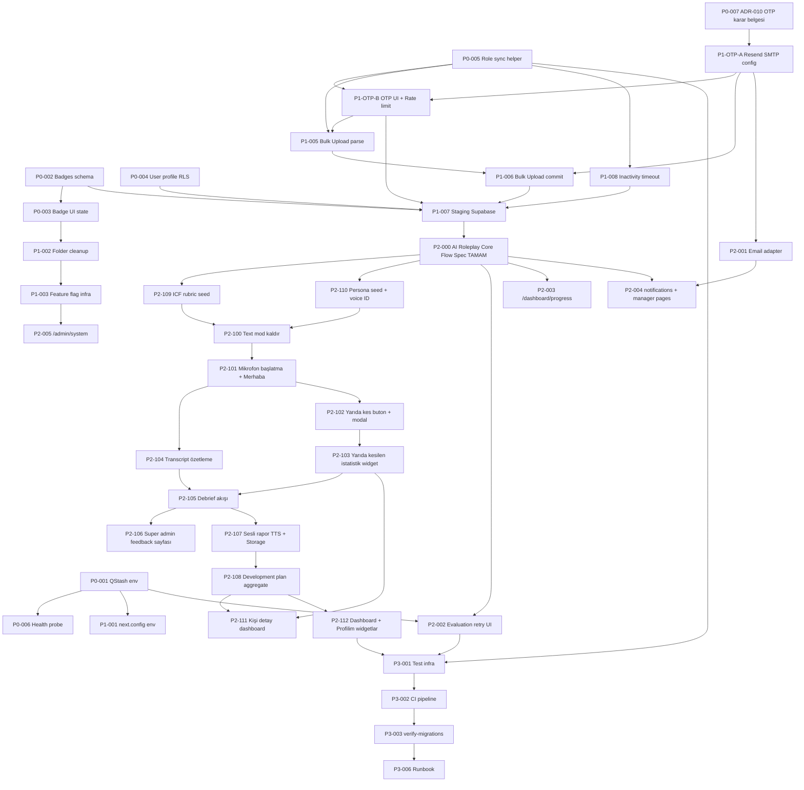

# AION Mirror / roleplay-saas — Yol Haritası

> Tarih: 2026-04-24
> Yazan: Project Shepherd
> Girdiler: `system_analiz_20260423.md`, `mimari_kararlar_20260423.md`, `akis_haritasi_20260423.md`, `Gelistime4Kontrol.md`, `CLAUDE.md`, `AGENTS.md`
> Güncelleme: 2026-04-24 akşam (P0-004, P0-007 tamamlandı; ek tamamlanan öğeler eklendi)
> Onay: Kullanıcı onayladı — aktif uygulama aşamasında

---

## 1. Executive Summary

**Faz sayısı:** 4 (Phase 0 → Phase 3)
**Toplam tahmini süre:** 18–26 iş günü → **33–48 iş günü** (Phase 2 AI Roleplay Core Flow spec'i 2026-04-24 session'ında kullanıcı ile birlikte yazıldı ve 13 ek iş paketi (P2-100..P2-112) açıldı; süre +15-22 iş günü arttı)
**Phase 0 + Phase 1:** KOD TAMAM (bekleyen DB migration + staging setup)
**Phase 2:** AI Roleplay Core Flow detaylandırıldı — voice-only + debrief + sesli rapor + özetleme + gelişim planı
**MVP showcase-ready eşiği:** Phase 2 sonunda (≈ 28-37 iş günü toplam)

**Kritik yol (sıralı, atlanamaz):**
`ADR-001..ADR-010 (Phase 0+1 tamam)` → `DB migration 024 + Staging setup` → **`P2-000 Spec (tamam)`** → `P2-109 ICF rubric seed + P2-110 Persona seed (PARALLEL)` → `P2-100 Voice-only migration` → `P2-101 Mikrofon başlatma + P2-104 Özet worker` → `P2-102/103 Yarıda kesme + istatistik` → `P2-105 Debrief + P2-106 feedback + P2-107 Sesli rapor + P2-108 Dev plan` → `P2-111/112 Dashboard entegrasyon` → `P2-001/002/003/004 Email + retry + placeholder` → `Phase 3 test altyapısı`

**Not — Akış 4 First-Login Password Change kaldırıldı:** ADR-010 ile şifre tabanlı auth tamamen kaldırıldığından bu akış geçersizdir.
**Not — Text mode kaldırıldı:** ADR-011 (2026-04-24) ile sadece sesli seans kaldı; text-based SessionClient Phase 2'de silinecek.

**En riskli 3 bağımlılık:**
1. **ADR-001 (QStash env) unutulursa evaluation pipeline sessizce öldüğünden Phase 2'nin öncesine kadar fark edilmez** — her deploy öncesi `.env` doğrulaması şart.
2. **ADR-007 Resend SMTP config (artık P0-sonu/P1-başı, P0'a yükseltildi)** → OTP mail gönderimi bu config'e bağımlı; config yapılmadan OTP UI test edilemez, invite akışı çalışmaz, bulk upload tamamlanamaz — tüm Phase 1 bu tek config'e kilitli.
3. **AI Roleplay Core Flow spec'i Phase 2'ye geçişin prerequisite'i** — ayrı Workflow Architect + AI Engineer session'ı planlanmadan Phase 2 başlatılamaz; takvim kayması riski burada.

**Phase 0 — Tamamlanan öğeler (2026-04-24):**
- ✅ P0-001 — QStash env zaten aligned, .env.local.example güncel
- ✅ P0-002 — badges migration yazıldı + `DO $$` idempotent fix uygulandı ⚠️ DB'de çalıştırılması bekleniyor
- ✅ P0-003 — GamificationLists optimistic state (toggle + delete sayfa yenilemesiz)
- ✅ P0-004 — `user` profil güncelleme RLS fix (migration 028)
- ✅ P0-005 — `src/lib/auth/role-sync.ts` + `updateUserRoleAction` JWT sync + force sign-out
- ✅ P0-006 — `/api/health` super_admin guard + env probe
- ✅ P0-007 — ADR-010 OTP/passwordless karar + tam implementasyon
- ✅ Ek: Rubric dimension kaydetme hatası (null → undefined)
- ✅ Ek: "Profesyonel Profil" dropdown navigasyon
- ✅ Ek: Bulk upload (BulkUploadSheet + action + Excel template API + dropdown validation)
- ✅ Ek: Turkish role mapping + toLocaleLowerCase('tr-TR')
- ✅ Ek: Auth callback token_hash + type flow
- ✅ Ek: Resend SMTP konfigürasyonu (mirror.aionmore.com)
- ✅ Ek: Kullanıcılar sayfası rol bazlı yetki (tenant_admin CRUD / hr_admin+manager read-only)

**Phase 1 — Tamamlanan öğeler (2026-04-24):**
- ✅ P1-001 — next.config.ts env-driven Supabase host (fallback ile)
- ✅ P1-002 — Stale `/sessions/new` route silindi; boş `src/modules/*/` README eklendi
- ✅ P1-003 — Feature flags (progressPage, notificationsPage, managerPages); placeholder sayfalar notFound(); nav flag-aware
- ✅ P1-OTP-A — Resend SMTP konfigürasyonu (kullanıcı yaptı)
- ✅ P1-OTP-B — 2-adımlı OTP login UI + Upstash Redis rate limiting
- ✅ P1-005/006 — Bulk upload parse + commit (sequential, per-row, inviteUserByEmail)
- ✅ P1-007 — ⏳ Staging Supabase projesi kurulumu (kullanıcı yapacak — manuel)
- ✅ P1-008 — Inactivity auto-logout (useIdleTimeout + IdleTimeoutManager + BroadcastChannel)

**Şimdi yapılacak:** Migration `20260424_024` DB'de çalıştır → P1-007 Staging Supabase kur → **Phase 2 AI Roleplay Core Flow spec session başlat.**

---

## 2. Faz Haritası

### Phase 0 — Stabilization (Kanayan Yaraları Kapat)

**Amaç:** Mevcut kullanıcı deneyimindeki canlı bug'ları kapat; deploy-blockable env/schema/auth sorunlarını çöz; Phase 1 için güvenli temel oluştur.

**Süre:** 4–6 iş günü (tek geliştirici, paralel lokomotif yok)

**Giriş koşulu (Entry):**
- Bu roadmap onaylanmış.
- Yerel dev server çalışıyor (`next.config.ts` turbopack.root fix uygulanmış durumda — `CLAUDE.md` Dev Server Notes'a göre 2026-04-23 tamam).
- `.env.local` dev Supabase değerleriyle dolu.

**Çıkış koşulu (Exit / Definition of Done):**
- `.env.local.example` kodda aranan env isimleriyle %100 uyumlu (kanıt: `grep -r "process.env" src/` listesi dosyada olan anahtarların hepsini içeriyor).
- Tenant admin `/tenant/gamification` sayfasında yeni rozet oluşturabiliyor, pasif/aktif yapabiliyor, silebiliyor; UI state her üç aksiyonda da sayfa yenilemesiz güncelleniyor (kanıt: Evidence Collector checklist §Akış 1'deki 5 madde).
- Standart `user` rolünde profil güncelleme (foto + input) çalışıyor (kanıt: `user` test hesabıyla manuel canlı kayıt).
- Rol değiştirince hem `users.role` hem `user_metadata.role` aynı anda güncelleniyor; kullanıcı force sign-out ediliyor (kanıt: ikinci tarayıcıda oturum açık kullanıcıda manuel rol değişim testi).
- `/api/health` endpoint'i QStash, OpenAI, ElevenLabs, Resend, Encryption key'lerinin set/unset durumunu raporluyor (anahtar ifşa etmeden).
- `npm run lint` temiz; `npx tsc --noEmit` temiz.

**Item Listesi:**

---

**P0-001 — QStash env var'larını kod gerçeğine hizala** ✅ TAMAMLANDI (2026-04-24)
- **ADR/Akış referansı:** ADR-001 + Akış 6
- **Öncelik:** P0
- **Efor:** S (1–2 saat)
- **Bağımlılık:** Yok
- **Kabul kriteri:**
  - `.env.local.example`'da `UPSTASH_QSTASH_TOKEN`, `UPSTASH_QSTASH_CURRENT_SIGNING_KEY`, `UPSTASH_QSTASH_NEXT_SIGNING_KEY`, `QSTASH_RECEIVER_URL` anahtarları mevcut.
  - Eski `QSTASH_URL` ve `QSTASH_TOKEN` satırları silinmiş.
  - `CLAUDE.md` "Key Environment Variables" bölümü yeni isimlerle güncel.
  - `/api/health` route handler'ı QStash env'lerinin varlığını boolean olarak raporluyor (sırları exposé etmiyor).
  - `grep -r "QSTASH" src/ scripts/` çıktısı kod ve docs arasında mismatch göstermiyor.
- **Agent:** builder → code-reviewer

---

**P0-002 — `badges` + `challenges` şema birleşimi (code unification)** ✅ Migration yazıldı + düzeltildi — ⚠️ DB çalıştırması bekleniyor
- **ADR/Akış referansı:** ADR-002 + ADR-009 + Akış 3.1.A–F
- **Öncelik:** P0
- **Efor:** M (3–5 saat)
- **Bağımlılık:** Yok (P0-001 ile paralel yapılabilir)
- **Kabul kriteri:**
  - Yeni migration dosyası: `supabase/migrations/20260424_024_badges_schema_unification.sql`. Timestamp formatı kurallı, idempotent (`IF EXISTS`, `IF NOT EXISTS`, `DROP POLICY IF EXISTS ... CREATE POLICY ...`).
  - Migration öncesi: `SELECT count(*) FROM badges WHERE badge_code IS NOT NULL` sonucu 0 doğrulaması yapılmış (veri kaybı riski sıfırlandı).
  - `badges.badge_code` DROP edilmiş; `badges.code` tek gerçeklik kaynağı; composite unique `(tenant_id, code)` constraint var (global `tenant_id IS NULL` için allow).
  - `challenges` tablosunda benzer: `name NOT NULL` → nullable; `title` birincil.
  - `src/lib/actions/gamification.actions.ts::createTenantBadgeAction` INSERT'te `code` field'ı set ediyor; Zod şeması (`BadgeSchema`) `code` (kebab-case regex) alanı zorunlu.
  - `src/components/tenant/GamificationForms.tsx` form'unda `code` input'u mevcut ve label'lı.
  - Manuel test: Yeni rozet oluştur → başarılı toast + liste güncelleniyor. Aynı code ile ikinci oluşturma → "Bu kod zaten kullanılıyor" hatası.
- **Agent:** builder → code-reviewer

---

**P0-003 — Badge/Challenge UI state bug'ları (delete + toggle)** ✅ TAMAMLANDI (2026-04-24)
- **ADR/Akış referansı:** Akış 3.1.C + 3.1.D (Gelistime4Kontrol.md Item #1 canlı kanıt)
- **Öncelik:** P0
- **Efor:** S (2–3 saat)
- **Bağımlılık:** P0-002 (migration bitmeden action'lar test edilemez)
- **Kabul kriteri:**
  - `toggleBadgeStatusAction` return tipi `{ success: true, newStatus: boolean }`; client (`GamificationLists.tsx`) bu değerle local state'i update ediyor (sunucu revalidatePath'e ek olarak).
  - `deleteBadgeAction` return tipi `{ deleted: true }` veya hata; client `setItems(prev => prev.filter(b => b.id !== badgeId))` ile listeden kaldırıyor.
  - `user_badges` kaydı olan bir badge için delete action `{ error: 'has_awards' }` dönüyor; UI "Silinemez, pasif yapın" modal gösteriyor.
  - Challenge tarafı için eşdeğer toggle + delete state update mantığı uygulandı.
  - Manuel test: Sayfa yenilemesiz toggle gerçekten UI'da değişiyor; silme sonrası kayıt listeden kaybolıyor (Gelistime4Kontrol.md Item #1'deki tüm semptomlar kapanıyor).
- **Agent:** builder → code-reviewer

---

**P0-004 — Standard `user` rolünde profil güncelleme + avatar upload bug'ı** ✅ TAMAMLANDI (2026-04-24)
- **ADR/Akış referansı:** CLAUDE.md "Next Session Work Queue" 2. madde NEW P0 bug + Gelistime4Kontrol.md Item #2 (tenant_admin çalıştı, user hâlâ bozuk)
- **Öncelik:** P0 (son kullanıcı görünürlüğü en yüksek item)
- **Efor:** M (3–5 saat)
- **Bağımlılık:** Yok
- **Kabul kriteri:**
  - `supabase/migrations/20260424_026_user_self_update_rls.sql` idempotent migration: `public.users` UPDATE policy'si `auth.uid() = id` self-update koşulunu içeriyor (tüm rolleri kapsıyor, tenant_admin'e özgü değil).
  - `storage.objects` üzerinde `avatars` bucket için INSERT/UPDATE policy'si authenticated user'ların kendi klasörüne yazmasına izin veriyor (path pattern: `avatars/{user_id}/*`).
  - `src/app/(dashboard)/dashboard/profile/page.tsx` ve ilgili action `profile.actions.ts` (veya `user.actions.ts` karşılığı) — service-role kullanımı audit edildi; self-update için SSR client yeterli.
  - Manuel test: `user` rolünde login → profil foto yükle → başarılı. İnput alan güncelleme → başarılı toast + sayfa yenilendiğinde güncel değer görünüyor.
  - Regresyon: `tenant_admin` profil güncelleme hâlâ çalışıyor.
- **Agent:** security-engineer (RLS policy draft) → builder (migration + action adapt) → code-reviewer

---

**P0-005 — Role sync helper + tüm write path'lerine bağla** ✅ TAMAMLANDI (2026-04-24)
- **ADR/Akış referansı:** ADR-008 + Akış 3.5 + Akış 3.3
- **Öncelik:** P0
- **Efor:** M (4–6 saat)
- **Bağımlılık:** Yok (P0-002 ile paralel)
- **Kabul kriteri:**
  - Yeni dosya `src/lib/auth/role-sync.ts` oluşturuldu; export: `syncUserRoleToJwt(userId: string, role: UserRole): Promise<void>`. İçinde: `supabase.auth.admin.updateUserById({ user_metadata: { role } })` + `audit_logs INSERT`.
  - `src/lib/actions/user.actions.ts::updateUserRoleAction` bu helper'ı çağırıyor; sırası: (1) users.role UPDATE, (2) helper, (3) force sign-out (`supabase.auth.admin.signOut(userId, 'others')`) — CLAUDE.md "Confirmed Product Decisions"a uyumlu.
  - `src/lib/actions/user.actions.ts::inviteUserAction` aynı helper'ı çağırıyor (user_metadata zaten createUser'da set ediliyor, helper audit log için).
  - `scripts/bootstrap-users.mjs` aynı sözleşmeye uyumlu (opsiyonel, P1'e ertelenebilir).
  - Unit test: `src/lib/auth/role-sync.test.ts` — mock Supabase admin client; helper doğru çağrıları yapıyor (en az 2 assertion).
  - Manuel test: İkinci tarayıcıda `user` rolüyle oturum aç → ilk tarayıcıda `tenant_admin` olarak rolü `manager`'a çek → ikinci tarayıcı bir sonraki request'te `/login`'e redirect ediyor.
- **Agent:** builder → code-reviewer → security-engineer (force sign-out davranışını doğrulama)

---

**P0-006 — Health endpoint'ini env probe ile genişlet** ✅ TAMAMLANDI (2026-04-24)
- **ADR/Akış referansı:** ADR-001 + Cross-cutting P7 (Graceful Degradation)
- **Öncelik:** P0
- **Efor:** S (1 saat)
- **Bağımlılık:** P0-001
- **Kabul kriteri:**
  - `GET /api/health` response'unda yeni `env` objesi: her kritik env için `set: boolean` (değerin kendisi değil). En az şunlar: `OPENAI_API_KEY`, `ELEVENLABS_API_KEY`, `UPSTASH_QSTASH_TOKEN`, `UPSTASH_QSTASH_CURRENT_SIGNING_KEY`, `UPSTASH_QSTASH_NEXT_SIGNING_KEY`, `QSTASH_RECEIVER_URL`, `RESEND_API_KEY`, `ENCRYPTION_KEY`, `APP_ENV`.
  - Authenticated mi unauthenticated mi açık olacağı karar: Sadece super_admin erişebilir (route-level guard) — saldırı yüzeyini daraltmak için.
  - Manuel test: super_admin olarak `/api/health`'e GET → JSON'da env section dolu; anonymous → 401.
- **Agent:** builder → code-reviewer

---

**P0-007 — ADR-010: Auth Method Email OTP (Passwordless) — Karar + Implementasyon** ✅ TAMAMLANDI (2026-04-24)
- **ADR/Akış referansı:** ADR-010 (yeni, Accepted) — karar + tam implementasyon yapıldı
- **Öncelik:** P0
- **Efor:** XS (30 dakika — dokümantasyon) + implementasyon (invite flow, auth callback, bulk upload)
- **Bağımlılık:** Yok
- **Kapsam:** Bu item bir implementation kalemi değildir. Amacı ADR-010'u `mimari_kararlar_20260423.md` dosyasına Accepted olarak eklemek ve etkilenen kalemler için audit trail oluşturmaktır.
- **ADR-010 Özeti:**
  - **Karar:** Şifre tabanlı auth → E-posta OTP (passwordless)
  - **Durum:** Accepted (kullanıcı 2026-04-24 onayladı)
  - **Gerekçe:** Temp password üretme / iletme / zorunlu değiştirme akışını ortadan kaldırır; invite + bulk upload akışlarını sadeleştirir; Supabase OTP native desteği ile düşük kurulum eforunda güçlü güvenlik sağlar.
  - **Kod uzunluğu:** 6 haneli (Supabase default, değiştirilmeyecek)
  - **Geçerlilik süresi:** 24 saat
  - **Yanlış deneme limiti:** 5 yanlış giriş → kod geçersiz
  - **"Beni hatırla":** Yok (MVP)
  - **E-posta gönderimi:** Resend SMTP → Supabase Dashboard SMTP Settings. Supabase dahili maili kullanılmayacak.
  - **Test kolaylığı:** `supabase.auth.admin.generateLink()` ile token direkt çekilir — mail beklemeden test.
  - **Rate limiting:** Upstash Redis (zaten yüklü) — OTP endpoint spam koruması.
  - **Etkilenen item'lar:** `~~P1-004 First-Login Password Change~~` (geçersiz), `P1-005/P1-006 Bulk Upload` (batch temp password kaldırıldı), `Akış 3 Invite Onboarding` (temp password adımı kaldırıldı), `ADR-007 Resend config` (criticality P0'a yükseltildi).
- **Kabul kriteri:**
  - `Gelistirme23Nisan/mimari_kararlar_20260423.md` dosyasına ADR-010 bölümü eklendi (Accepted, tarih, gerekçe, etkilenen item'lar).
  - Etkilenen ADR'ların (ADR-007) güncellendiği not düşüldü.
- **Agent:** user (onay zaten alındı) → builder (dokümantasyon kalemi)

---

### Phase 1 — Deploy-Ready MVP

**Amaç:** MVP için production deploy'a hazır hâle gelmek; OTP auth altyapısını kur; invite-only onboarding + bulk upload akışlarını OTP tabanlı sürümüyle uçtan uca çalışır kılmak; klasör artıklarını temizlemek; placeholder sayfaları flag arkasına almak; enterprise güvenlik beklentisi olan inactivity auto-logout'u devreye almak.

**Not:** ~~First-Login Password Change~~ akışı (Akış 4) ADR-010 ile geçersiz kılındığından bu fazdan çıkarılmıştır.

**Süre:** 7–11 iş günü (Akış 4 kaldırıldı −1,5 gün; OTP item eklendi +1,5 gün; net takvim değişmedi ama kapsam daha temiz)

**Giriş koşulu (Entry):**
- Phase 0 Exit kriterleri %100 karşılandı (P0-007 ADR-010 dokümantasyonu dahil).
- `npm run lint` + `npx tsc --noEmit` temiz.
- Manuel "happy path" dumanı geçti: OTP ile login → dashboard → yeni seans → chat turu → değerlendirme geliyor (test OpenAI key ile).

**Çıkış koşulu (Exit / Definition of Done):**
- **OTP login akışı çalışıyor, Resend üzerinden mail gidiyor** (e-posta gir → OTP al → 6 haneli kod gir → dashboard'a giriş).
- Tenant admin CSV/XLSX ile 200 satıra kadar bulk kullanıcı upload'u yapabiliyor; preview → commit → "Kullanıcılara OTP daveti gönderildi" mesajı çalışıyor (Evidence Collector §Akış 2 checklist — batch temp password adımı kaldırıldı).
- Davet edilen veya bulk upload ile oluşturulan kullanıcı ilk girişte OTP alıyor, şifre değiştirme ekranı **yok**.
- `npm run build` temiz, route collision uyarısı yok.
- `/dashboard/progress`, `/dashboard/notifications`, `/manager/team`, `/manager/reports` URL'lerine gidilince 404 dönüyor (flag kapalı); nav'da gözükmüyor.
- `next.config.ts` hardcoded Supabase host içermiyor; env'den çekiyor.
- Staging Supabase projesi kurulmuş ve tüm migration'lar temiz sırada uygulanmış (ADR-009'un "clean install test"i manuel pass).
- Inactivity timeout mekanizması tüm authenticated route'larda çalışıyor; 30 dk idle → modal + 5 dk geri sayım → otomatik logout (kanıt: P1-008 manuel test checklist'i).

**Item Listesi:**

---

**P1-001 — `next.config.ts` env-driven Supabase host** ✅ TAMAMLANDI (2026-04-24)
- **ADR/Akış referansı:** ADR-005 (Accepted)
- **Öncelik:** P1
- **Efor:** S (30 dakika)
- **Bağımlılık:** Yok
- **Kabul kriteri:**
  - `next.config.ts` `NEXT_PUBLIC_SUPABASE_URL`'den hostname parse ediyor; hardcoded `dqmivckxqdvwlzudshlz.supabase.co` yok.
  - Env yoksa build warning (error değil).
  - Manuel test: Dummy `.env.local`'da farklı bir hostname → `npm run build` başarılı; remotePattern doğru host'u içeriyor.
- **Agent:** builder → code-reviewer

---

**P1-002 — Klasör artıklarını temizle + route collision'ı sıfırla** ✅ TAMAMLANDI (2026-04-24)
- **ADR/Akış referansı:** ADR-003
- **Öncelik:** P1
- **Efor:** S (1 saat)
- **Bağımlılık:** Yok
- **Kabul kriteri:**
  - Silinmiş: `src/app/dashboard/` (parantezsiz), `src/app/manager/` (parantezsiz), `src/app/\(dashboard\)/` (escape bug artığı), `src/app/(admin)/` içeriği, `src/app/(manager)/` içeriği, `src/app/api/` altındaki boş 9 route dizini (sadece `.gitkeep` olanlar).
  - `src/modules/` altındaki 10 boş klasöre tek satırlık README konmuş ("Bu klasör `src/lib/actions/*` ve `src/lib/queries/*`'deki ilgili dosyalar için domain-aligned refactor hedefidir. Şimdilik boş.").
  - `npm run build` temiz (route collision hatası yok).
  - `git status` sadece beklenen silme/ekleme'leri gösteriyor.
- **Agent:** builder → code-reviewer

---

**P1-003 — Feature flag infra + placeholder sayfaları flag arkasına al** ✅ TAMAMLANDI (2026-04-24)
- **ADR/Akış referansı:** ADR-004 + Cross-cutting P4
- **Öncelik:** P1
- **Efor:** M (3–4 saat)
- **Bağımlılık:** P1-002 (klasör temizliği sonrası nav değişikliği)
- **Kabul kriteri:**
  - Yeni dosya `src/lib/features.ts`: `export const isEnabled = (flag: string) => process.env[flag] === 'true'`.
  - `.env.local.example`'a yeni flag'ler: `FEATURE_PROGRESS_PAGE_ENABLED`, `FEATURE_NOTIFICATIONS_PAGE_ENABLED`, `FEATURE_MANAGER_PAGES_ENABLED`. Default `false`.
  - `src/lib/navigation.ts` flag-aware — kapalı feature'ların nav item'ı render edilmiyor.
  - 4 placeholder sayfa (`progress`, `notifications`, `manager/team`, `manager/reports`) — flag kapalı ise `notFound()` dönüyor; sayfa dosyası kalıyor (flag açılınca içerik eklenecek yer hazır).
  - `/admin/system` route'u middleware `SUPER_ADMIN_ROUTES` array'inden çıkarıldı (ya tamamen ya da `FEATURE_ADMIN_SYSTEM_ENABLED` flag arkasında).
  - Manuel test: Flag kapalı → sidebar'da 4 item yok, URL girilirse 404; `.env`'de flag açılınca item görünür ve sayfa yükleniyor.
- **Agent:** builder → code-reviewer

---

**~~P1-004 — `users.password_must_change` migration + First-Login guard~~** *(ADR-010 ile geçersiz kıldı — passwordless OTP auth'a geçildiğinden temp şifre + zorunlu şifre değiştirme akışı tamamen kaldırıldı)*

---

**P1-OTP-A — Resend SMTP → Supabase Auth SMTP bağlantısı (ADR-007 prereq)** ✅ TAMAMLANDI (2026-04-24)
- **ADR/Akış referansı:** ADR-007 (Resend notification adapter) — criticality P0'a yükseltildi; OTP mail gönderimi için zorunlu prereq
- **Öncelik:** P0 (Phase 1 başı, OTP UI'dan önce tamamlanmalı)
- **Efor:** XS (30 dakika — Dashboard config, sıfır kod)
- **Bağımlılık:** Yok (sadece Resend hesabı + domain DNS erişimi gerekli)
- **Kapsam:** Bu item tamamen Supabase Dashboard + Resend Dashboard üzerinde yapılan konfigürasyon işidir; kod değişikliği yoktur.
- **Yapılacaklar:**
  1. Resend Dashboard → Domains → domain ekle + DKIM/SPF/DMARC DNS kayıtlarını ekle (deliverability için kritik — Açık Soru O16'ya bak).
  2. Resend Dashboard → API Keys → `aion-supabase-smtp` adında key oluştur (send-only scope).
  3. Supabase Dashboard → Project Settings → Authentication → SMTP Settings: Enable custom SMTP, Host: `smtp.resend.com`, Port: `465`, Username: `resend`, Password: Resend API key, Sender name: `AION Mirror`, Sender email: `noreply@[domain]`.
  4. Supabase Dashboard → Authentication → Email Templates → OTP template'ini Türkçe'ye çevir + 6 haneli kod içerecek şekilde düzenle (ör: "AION Mirror giriş kodunuz: {{ .Token }}").
  5. `.env.local.example`'a `RESEND_API_KEY=` eklenmişse audit et — P0-001/P0-006 zaten bu key'i listeliyor.
- **Kabul kriteri:**
  - Supabase Auth SMTP Settings'te custom SMTP aktif ve test maili "Send test email" ile başarılı.
  - Resend Dashboard'da test mail delivered (not bounced/spam).
  - OTP template Türkçe, kodu içeriyor.
  - DNS kayıtları (DKIM/SPF) Resend doğrulama ekranında yeşil.
- **Agent:** user (Dashboard config — kod değişikliği yok)

---

**P1-OTP-B — OTP Auth UI + Rate Limiting** ✅ TAMAMLANDI (2026-04-24)
- **ADR/Akış referansı:** ADR-010 (Accepted) + ADR-007
- **Öncelik:** P1 (P1-OTP-A bitmeden başlanmaz; Akış 2 + Akış 3'ten önce tamamlanmalı)
- **Efor:** M-L (6–10 saat, 1–1,5 iş günü — ağırlık login UI + rate limit)
- **Bağımlılık:** P1-OTP-A (Resend SMTP config aktif olmalı), P0-005 (role sync)
- **Kabul kriteri:**
  - **Login sayfası 2 adımlı UI:**
    - Adım 1: E-posta giriş formu → "Giriş Kodu Gönder" butonu → `supabase.auth.signInWithOtp({ email, options: { shouldCreateUser: false } })` çağrısı. (`shouldCreateUser: false` — invite-only MVP; kayıtsız mail OTP alamaz.)
    - Adım 2: 6 haneli kod input formu → "Giriş Yap" butonu → `supabase.auth.verifyOtp({ email, token, type: 'email' })`. Geri sayım yok (24 saat geçerli). 5 yanlış → "Kod geçersiz, yeni kod isteyin" mesajı.
  - **Rate limiting — Upstash Redis:**
    - Yeni dosya `src/lib/ratelimit/otp.ratelimit.ts` — `@upstash/ratelimit` kullanan `checkOtpRateLimit(ip: string)`. Limit: 5 istek / 10 dakika / IP.
    - `/api/auth/otp/request` (veya login page server action) rate limit check'i yapıyor; limit aşılırsa `429` + "Çok fazla deneme, lütfen bekleyin." mesajı.
  - **Middleware güncellemesi:** Mevcut `middleware.ts` şifre tabanlı session check'ini OTP/JWT tabanlı Supabase session'a uygun hale getir (zaten Supabase SSR kullanıyorsa minimal değişim).
  - **Test helper:** `src/lib/auth/otp-test-helper.ts` — `generateTestOtpLink(email: string)` → `supabase.auth.admin.generateLink({ type: 'magiclink', email })` → token'ı döndürür. Sadece `NODE_ENV !== 'production'` ortamlarda kullanılabilir.
  - Manuel test:
    - Kayıtlı kullanıcı: e-posta gir → mail geldi → 6 haneli kod gir → dashboard'a giriş.
    - Kayıtsız e-posta: "Bu e-posta adresiyle kayıtlı hesap bulunamadı" hatası.
    - 5 yanlış kod: "Kod geçersiz, yeni kod isteyin" — yeni OTP talep etmek gerekiyor.
    - Rate limit: 6. istek → "Çok fazla deneme" hatası.
    - Test helper: `generateTestOtpLink` ile prod dışında mail beklemeden login.
  - `npm run lint` + `npx tsc --noEmit` temiz.
- **Agent:** builder → code-reviewer → security-engineer (rate limit parametrelerini ve `shouldCreateUser: false` davranışını doğrulama)

---

**P1-005 — Bulk CSV/XLSX Upload — Phase A (parse + preview)** ✅ TAMAMLANDI (2026-04-24)
- **ADR/Akış referansı:** Akış 3.2 (bulk upload) — parse aşaması
- **ADR-010 scope notu:** Batch temp password üretme / gösterme / "one-time clipboard" akışı kaldırıldı (ADR-010). Kullanıcılar oluşturulunca OTP mail otomatik gider; admin'e temp şifre gösterilmez.
- **Öncelik:** P1
- **Efor:** L (1,5 iş günü)
- **Bağımlılık:** P1-OTP-B (OTP altyapısı aktif olmalı — commit sonrası OTP maili tetiklenecek), P0-005 (role-sync)
- **Kabul kriteri:**
  - Yeni paket: `xlsx` (SheetJS) veya `papaparse` — package.json'a eklenmiş.
  - Yeni API route `src/app/api/bulk-upload/template/route.ts` — XLSX şablon dosyası (header: `Ad Soyad | E-posta | Rol | Departman`; 4 örnek satır; footer kural notları — akis §4'teki şablon).
  - Yeni client component `src/components/tenant/BulkUploadDialog.tsx` — file input, drag-drop, 2MB limit, preview tablosu.
  - Yeni server action `src/lib/actions/user.actions.ts::parseBulkUploadAction(formData): Promise<{ rows, errors, summary }>` — row-level validation (akis §3.2.B'deki 8 hata kodu).
  - Preview ekranı: `valid` (yeşil), `error` (kırmızı + mesaj), `duplicate_in_batch` (turuncu), `duplicate_existing` (sarı). 200+ satır → kabul edilmez.
  - `/tenant/users` sayfasında "Toplu Kullanıcı Yükle" butonu — dialog'u açıyor.
  - Manuel test: Örnek XLSX dosyası ile yükle → preview doğru; hatalı satırlar kırmızı; tüm hatalar kritik gösteriliyor.
- **Agent:** workflow-architect (validation kural tablosu) → builder → code-reviewer

---

**P1-006 — Bulk CSV/XLSX Upload — Phase B (commit + OTP invite)** ✅ TAMAMLANDI (2026-04-24)
- **ADR/Akış referansı:** Akış 3.2 (bulk upload) — commit aşaması
- **ADR-010 scope notu:** Batch temp password üretme / gösterme / "one-time clipboard" akışı tamamen kaldırıldı (ADR-010). Her kullanıcı `auth.admin.createUser` ile oluşturulur; Supabase `shouldSendEmail: true` ile OTP davet mailini otomatik gönderir. Admin'e temp şifre gösterilmez.
- **Öncelik:** P1
- **Efor:** L (1 iş günü)
- **Bağımlılık:** P1-005, P1-OTP-A (Resend SMTP config aktif olmalı — aksi hâlde davet maili gitmez)
- **Kabul kriteri:**
  - Yeni server action `commitBulkUploadAction(validatedRows): Promise<{ created, skipped, failed }>`. Temp password parametresi kaldırıldı.
  - Commit sequential (for-of + await); Promise.all yok (rate limit).
  - Her satır için: `supabase.auth.admin.createUser({ email, email_confirm: false })` + `public.users INSERT` + `syncUserRoleToJwt` (P0-005 helper'ı). Supabase, kullanıcıya OTP davet mailini kendi gönderir.
  - Partial failure yönetimi akis §3.2.C'deki kurala uyumlu (başarılı olanlar geri alınmaz; duran yerde özet döner).
  - Commit sonrası ekranda özet: "{N} kullanıcı oluşturuldu, davet maili gönderildi." Tek seferlik temp password modal'ı yok.
  - `revalidatePath('/tenant/users')` sonrası liste yenileniyor.
  - Manuel test: 10 satırlık dosya commit → 10 kullanıcı `users` tablosunda; 9. satırda bilerek duplicate e-posta konulsa → 8 oluşturuluyor, kullanıcıya net mesaj.
- **Agent:** builder → code-reviewer → security-engineer (createUser parametreleri + OTP mail tetikleyici doğrulama)

---

**P1-007 — Staging Supabase projesi kurulumu + migration clean-install testi**
- **ADR/Akış referansı:** ADR-005 (Accepted) + ADR-009 + CLAUDE.md "Supabase env strategy"
- **Öncelik:** P1
- **Efor:** M (3–4 saat, çoğu el işi)
- **Bağımlılık:** P0-002, P0-004, P1-OTP-B, P1-006 (yeni migration'lar tamam olmalı; P1-004 kaldırıldı — ADR-010)
- **Kabul kriteri:**
  - Ayrı bir Supabase projesi (staging) oluşturuldu; URL + anon key + service role key alınmış.
  - `supabase/migrations/` altındaki tüm SQL dosyaları sırayla (alfanumerik) Supabase SQL Editor'a yapıştırılıp uygulanmış — hata yok.
  - Beklenen tablo/enum/policy count'ları not edilmiş (basit sanity check).
  - Staging `.env.staging` dosyası hazır (kod repo'suna girmeyecek — `.gitignore` kontrol).
  - `avatars` bucket staging'de manuel oluşturulmuş (storage migration hâlâ manuel).
  - Manuel test: Staging deploy'u (lokal `npm run build` + Vercel preview veya eşdeğer) → login akışı çalışıyor; hardcoded host yok, staging URL üzerinden çalışıyor.
- **Agent:** devops-automator → builder (migration fix gerekirse)

---

**P1-008 — Inactivity timeout + auto-logout (tüm authenticated kullanıcılar için)** ✅ TAMAMLANDI (2026-04-24)
- **ADR/Akış referansı:** Yeni gereksinim (2026-04-24) — kullanıcı talebi. ADR bağımlılığı yok; `akis_haritasi_20260423.md` §3.5 (rol değişiminde force sign-out) ile paralel güvenlik mantığı.
- **Öncelik:** P1
- **Efor:** M (5–7 saat; takvim: 1 iş günü)
- **Bağımlılık:** P0-005 (role-sync helper `supabase.auth.admin.signOut` pattern'ini tanımlı hale getiriyor — client-side `supabase.auth.signOut()` tek başına yeterli ama server-side invalidate helper'ı gelecekte burada da kullanılacak). Phase ölçeğinde hard blok değil; paralel başlatılabilir.
- **Kapsam:** Tüm authenticated dashboard route'ları (user, manager, hr_viewer, hr_admin, tenant_admin, super_admin). Auth layout (login, forgot-password, change-password) hariç.
- **Kabul kriteri:**
  - Yeni config dosyası `src/lib/config/session-timeout.ts` — `IDLE_TIMEOUT_MS` (default 30 * 60 * 1000), `WARNING_DURATION_MS` (default 5 * 60 * 1000). Constant + `process.env.SESSION_IDLE_TIMEOUT_MINUTES` ile override hook'u (MVP default constant; env sadece QA için).
  - Yeni client hook `src/hooks/useIdleTimeout.ts` — `mousemove`, `keydown`, `touchstart`, `scroll`, `click` event listener'ları (throttle 1 sn). Timer son etkileşimden itibaren 30 dk sonra `onIdle` callback'ini tetikliyor.
  - Yeni component `src/components/auth/IdleTimeoutDialog.tsx` — shadcn `Dialog` tabanlı modal. Açılınca:
    - Başlık: "Oturumunuz sonlandırılacak"
    - Mesaj: "5 dakika içinde işlem yapılmazsa oturumunuz otomatik olarak kapatılacak."
    - Canlı geri sayım (mm:ss formatı, her saniye güncellenen).
    - 2 buton: "Devam Et" (primary) → timer reset, dialog kapanır. "Çıkış Yap" (secondary) → `supabase.auth.signOut()` + `router.push('/login')`.
  - Cross-tab senkronizasyonu: `BroadcastChannel('aion-activity')` ile son aktivite timestamp'i yayınlanıyor. Herhangi bir tab'da aktivite varsa diğer tab'ların timer'ı reset oluyor ve modal görünüyorsa kapanıyor. Fallback: `storage` event ile `localStorage` (tarayıcı desteği için).
  - 5 dk modal süresinde de inactive kalınırsa otomatik logout: `supabase.auth.signOut()` + `router.push('/login?reason=idle')`. Login sayfasında `reason=idle` query param varsa bilgilendirme toast'u "Uzun süre işlem yapılmadığı için oturumunuz kapatıldı."
  - Integration noktası: `src/app/(dashboard)/layout.tsx` içine `<IdleTimeoutProvider>` wrap — auth layout'tan (login vb.) ayrı olduğu garantili.
  - AI roleplay session sayfası (`/dashboard/sessions/[id]`): Bu item MVP'de standart idle tanımını kullanır (son kullanıcı etkileşimi). AI streaming sırasında user klavyeye dokunmuyorsa timer çalışmaya devam eder. **Farklı davranış Açık Soru O13'te.**
  - Manuel test (fake timer kabulü):
    - Login → 30 dk bekle (veya dev override ile 30 sn) → modal görünür.
    - Modal'da geri sayım 5:00'dan başlar, her saniye azalır.
    - "Devam Et" → modal kapanır, timer sıfırdan başlar.
    - "Çıkış Yap" → login sayfası, toast "Oturumunuz kapatıldı".
    - 30 dk sonra modal açık iken 5 dk daha bekle → otomatik logout + `?reason=idle` + toast.
    - 2 tab aç, birinde mouse hareket et → diğer tab'da modal görünmüyor.
    - Auth layout'ta (login sayfası) bu mekanizma aktif değil (network tab'da ilgili hook çalışmıyor).
  - Regresyon: AI roleplay session aktifken klavye etkileşimi (mesaj gönderme) sayaç reset ediyor (mevcut `useIdleTimeout` hook'u klavye event'ini zaten yakalıyor).
  - `npm run lint` + `npx tsc --noEmit` temiz.
- **Agent:** builder → code-reviewer (opsiyonel: ui-designer dialog copy + geri sayım formatı için)

---

### Phase 2 — AI Roleplay Core Flow + Feature Completion

**Amaç:** Kullanıcının ana ürün deneyimini (ses tabanlı koçluk roleplay seansı → debrief → rapor → gelişim önerileri) uçtan uca çalışır, demo-edilebilir ve ölçülebilir kaliteye taşı. Aynı zamanda MVP'nin diğer eksiklerini (transactional e-posta, placeholder sayfalar) kapat.

**Süre:** 15–22 iş günü (spec 2026-04-24 günü kullanıcı ile tamamlandı; spec ayrı session'a gerek kalmadı, P2-000 tamamlandı olarak işaretlendi ve detaylar inline geldi)

**Giriş koşulu (Entry):**
- Phase 1 Exit kriterleri %100.
- ICF rubric dokümanı (`rubric_icf_20260424.md`) hazır ve onaylı. ✓
- Yol haritasında Phase 2 item'ları (P2-100 serisi) onaylı.
- Mevcut persona/scenario/rubric verisi Supabase'den çekilmiş, seed SQL hazır.

**Çıkış koşulu (Exit / Definition of Done):**
- Kullanıcı mikrofon butonuna basarak sesli seans başlatabiliyor; persona "Merhaba" diyerek açılış yapıyor; barge-in çalışıyor.
- Kullanıcı "Seansı Yarıda Kes" butonu ile seansı keserse AI analizi tetiklenmiyor; reason modal 4 seçenek sunuyor; yarıda kesilen seans istatistiği dashboard'da, profilde ve `/tenant/users/{id}` kişi detay sayfasında görünüyor.
- Seans "Seansı Bitir" ile biter bittiğinde farklı voice ID'li koç (debrief) kullanıcı ile 1-2 dk samimi sohbet ediyor; arka planda değerlendirme çalışıyor.
- Debrief sona erdiğinde evaluation hazırsa rapor sayfası açılıyor; hazır değilse "Seans Raporunuzu Hazırlıyorum" mesajı gösteriliyor ve hazır olunca otomatik yönlendirme oluyor.
- Rapor sayfasında tüm rubric boyutları skor + evidence ile birlikte gösteriliyor; sayfa ile aynı anda TTS ile öneriler/tavsiyeler bölümü sesli okunuyor (ses Supabase Storage'da kayıtlı, tekrar dinlenebilir).
- Her 5-10 mesajda transcript özeti background worker ile çıkartılıp bir sonraki LLM çağrısında kullanılıyor; son 40 mesajı doğrudan gönderme yaklaşımı kaldırıldı.
- Dashboard'da ve profilim sayfasında: "Koçluk Becerileri Özeti" + "Gelişim Önerileri + Eğitim/Kitap Önerileri" bölümleri var; tenant/HR rolleri bu bilgiyi kullanıcı-bazlı görebiliyor (`/tenant/users/{id}`).
- ICF 8 standart rubric + seçilen 2-4 custom rubric seed DB'de mevcut; tenant admin custom rubric'i aktif/pasif ya da düzenleyebiliyor (ICF standart rubric kilitli — değiştirilemez).
- 5 persona (her biri farklı voice ID + zorluk seviyesi) + her persona için 2-3 senaryo seed DB'de aktif.
- Super admin kullanıcı-debrief geri bildirimlerini "Kullanıcı Geri Bildirimleri" sayfasında görüp persona/senaryo prompt iyileştirme öneri olarak okuyabiliyor.
- Resend email adapter çalışıyor; "Değerlendirme hazır" + "Hesabınız oluşturuldu" e-postaları prod'da tetikleniyor.
- 4 placeholder sayfa (progress, notifications, manager/team, manager/reports) gerçek içerikle dolu; flag'ler staging'de açık.
- Evaluation pipeline'ın kalıcı başarısızlık UI'ı devrede: 3 retry sonrası `evaluation_failed` state + "Yeniden dene" butonu görünüyor.

**Item Listesi:**

---

**P2-000 — AI Roleplay Core Flow Spec** ✅ TAMAMLANDI (2026-04-24 — kullanıcı ile spec session'ı)
- **ADR/Akış referansı:** CLAUDE.md "Next Session Work Queue" 3. madde + akis §5 "Deferred Scope"
- **Çıktı:** Bu dokümanın Phase 2 bölümü + `Gelistirme23Nisan/rubric_icf_20260424.md` + yeni ADR'ler (ADR-011 Voice-Only Mode, ADR-012 Debrief Architecture, ADR-013 Transcript Summarization, ADR-014 Persona Voice ID Mapping, ADR-015 Development Plan Aggregation)
- **Ürün kararları (kullanıcı onaylı):**
  - Sadece sesli seans (text mod kaldırılacak)
  - Seans başlangıcı: mikrofon butonu → persona "Merhaba" ile başlar
  - "Seansı Yarıda Kes" → AI değerlendirmesi YOK; yarıda kesilen seans istatistiği dashboard'da
  - Barge-in (AI'ın sözünü kesmek) korunacak
  - Ses kaydı saklanmaz, sadece transcript şifreli
  - Transcript özeti: 5-10 mesaj arası (kalite önceliği), background worker
  - Debrief: farklı ElevenLabs voice ID (tok ses, koç karakteri), AI-driven prompt, 1-2 dk samimi sohbet
  - Debrief transcript'i evaluation'a GİRMEZ, ama super_admin "Kullanıcı Geri Bildirimleri" sayfasında görür (persona/senaryo prompt iyileştirme için)
  - Evaluation arka planda paralel çalışır; debrief bittiğinde hazır değilse "Hazırlıyorum" mesajı
  - Rapor sesli okuma: tüm metin okunur (genel puan hariç); ortalama karşılaştırması eklenir ("bu seans ortalamanızdan X puan yüksek"); sadece dinleme modu; Supabase Storage'da ses kayıtlı, tekrar dinlenebilir
  - STT: OpenAI Whisper; TTS: ElevenLabs Turbo; LLM: `OPENAI_LLM_MODEL` env'den (güncel `gpt-5.4`)
  - ICF 8 standart + 2-4 custom rubric template
  - 5 persona + 2-3 senaryo / persona
  - Dashboard + profilim: koçluk becerileri özeti + gelişim/eğitim/kitap önerileri (son N seans aggregate)
- **Kabul kriteri:** Spec P2-100..P2-112 iş paketlerine dönüştürüldü ✓; ADR'ler yazıldı ✓; rubric doküman hazır ✓
- **Agent:** user + workflow-architect (tamamlandı)

---

### Phase 2 — P2-100 Serisi (AI Roleplay Core Flow Implementation)

---

**P2-100 — Text Modu Kaldırma + Voice-Only Migration**
- **ADR/Akış referansı:** ADR-011 (Voice-Only Mode)
- **Öncelik:** P2-yüksek
- **Efor:** M (4–6 saat)
- **Bağımlılık:** P2-000 ✓
- **Kabul kriteri:**
  - `sessions.session_mode` enum'undan `text` değeri kaldırıldı (migration + mevcut text seansları `completed/cancelled` olarak arşivle).
  - `createSessionAction` artık `sessionMode` parametresi almıyor — her zaman `voice`.
  - `NewSessionStepper`'dan "Text" / "Voice" seçim adımı kaldırıldı; sadece persona → senaryo → "Başlat" akışı kaldı.
  - `src/components/sessions/SessionClient.tsx` (text client) silindi.
  - `src/app/(dashboard)/dashboard/sessions/[id]/page.tsx` artık doğrudan `VoiceSessionClient` render ediyor; session_mode dalında branching yok.
  - `src/stores/session.store.ts` ve `voice-session.store.ts` tekleştirildi VEYA voice store aktif kaldı, text-spesifik alanlar temizlendi.
  - `npm run lint` temiz + `npx tsc --noEmit` temiz.
  - Manuel test: Yeni seans oluştur → direkt voice ekranına git → mikrofon butonu görünür, text input yok.
- **Agent:** builder → code-reviewer

---

**P2-101 — Seans Başlatma Mikrofon Butonu + Persona "Merhaba" Açılışı**
- **ADR/Akış referansı:** ADR-011 + A2 ürün kararı
- **Öncelik:** P2-yüksek
- **Efor:** M (3–5 saat)
- **Bağımlılık:** P2-100
- **Kabul kriteri:**
  - Sayfa yüklendiğinde otomatik `__INIT__` göndermiyor; kullanıcı mikrofon butonuna basmadıkça LLM çağrısı yok.
  - İlk mikrofon tıklamasında:
    1. Mikrofon izni iste (gerekirse)
    2. `activateSessionAction` çağrılır (pending → active, system prompt üretilir)
    3. Persona TR "Merhaba" selamlama yapar (LLM'e "Seansı başlat, kısa bir 'Merhaba' ile aç" promptu)
    4. TTS ile ses oynatılır
    5. VAD dinlemeye başlar
  - "Merhaba" geldikten sonra kullanıcı mikrofona tekrar basmasına gerek yok — VAD otomatik dinler + barge-in çalışır.
  - Manuel test: Yeni seans → sayfa açıldığında sessizlik → mikrofona bas → persona "Merhaba {kullanıcı adı}" der → kullanıcı konuşmaya başlayınca VAD yakalar.
- **Agent:** builder → code-reviewer

---

**P2-102 — "Seansı Yarıda Kes" Butonu + Reason Modal + Kategori Sistemi**
- **ADR/Akış referansı:** B + reason taxonomy kararı (seçenek b)
- **Öncelik:** P2-yüksek
- **Efor:** M (4–6 saat)
- **Bağımlılık:** P2-100
- **Kabul kriteri:**
  - Header'daki "Seansı Bitir" butonu iki ayrı eyleme bölündü:
    - **"Seansı Bitir"** (primary) → `endSessionAction` → debrief akışı başlar → AI değerlendirmesi tetiklenir
    - **"Seansı Yarıda Kes"** (secondary, destructive style) → reason modal açılır → seçim yapılır → `cancelSessionAction` → AI değerlendirmesi YOK
  - Reason modal 4 seçenek:
    - `technical_issue` — Teknik problem yaşadım (ses/mikrofon/bağlantı)
    - `persona_wrong_fit` — Persona/karakter beklediğim gibi değildi
    - `scenario_too_hard` — Senaryo zorlayıcıydı, şimdi hazır değilim
    - `user_interrupted` — Başka bir sebeple şimdi devam edemem
  - `sessions.cancellation_reason` kolonuna bu değerler yazılıyor (enum migration).
  - Listelenen tüm bu reason'lar "Yarıda Kesilen Seans" kategorisine dahil; `completed_naturally` reason'u `cancelSessionAction` tarafından alınmıyor (o ayrı eyleme taşındı).
  - Manuel test: Seansı yarıda kes → modal çıkıyor → seçim yapılıyor → DB'de `status='cancelled'` + `cancellation_reason` var → evaluation job tetiklenmedi (QStash queue'sunda entry yok).
- **Agent:** builder → ui-designer (modal copy + UX) → code-reviewer

---

**P2-103 — Yarıda Kesilen Seans İstatistik Widget'ları**
- **ADR/Akış referansı:** B1 + B2 + B3 ürün kararları
- **Öncelik:** P2-orta
- **Efor:** L (1.5 iş günü)
- **Bağımlılık:** P2-102
- **Kabul kriteri:**
  - **Yeni query:** `src/lib/queries/session-stats.queries.ts` — `getUserInterruptedSessions(userId)` → persona bazlı aggregate + her seans için tekil detay (liste).
  - **Dashboard widget** (`/dashboard/dashboard`): "Yarıda Kesilen Seanslar" kartı
    - Ana tablo: Persona | Ortalama kesilme süresi (dk) | Kaç defa kesildi
    - Satıra tıklanınca accordion açılır: o persona'nın senaryo bazında seans listesi (Persona adı | Senaryo | Toplam süre | Tarih | Saat | Reason etiketi)
  - **Profil sayfası widget** (`/dashboard/profile`): Aynı tablo, "Profilim > Seans İstatistikleri" sekmesinde.
  - **Tenant/HR/Manager görünüm** (`/tenant/users/{userId}`): Rol bazlı erişim ile aynı widget, hedef kullanıcının istatistiğini gösterir.
    - Yeni route: `src/app/(dashboard)/tenant/users/[id]/page.tsx`
    - Erişim: `tenant_admin`, `hr_admin`, `hr_viewer`, `manager` → tenant içi tüm kullanıcılar
  - Dashboard'un ana özet kısmında: "Son 30 gün: X seans yarıda kesildi" + trend (önceki 30 güne göre).
  - Manuel test: 3 seansı farklı persona/senaryo ile yarıda kes → dashboard'da tablolar doğru hesaplanmış; tenant_admin başka kullanıcının dashboard'unu açtığında aynı veriyi görüyor.
- **Agent:** builder → ui-designer (widget layout) → code-reviewer

---

**P2-104 — Transcript Summarization Background Worker**
- **ADR/Akış referansı:** ADR-013 (Transcript Summarization) + C1 + C2 ürün kararları
- **Öncelik:** P2-yüksek (token maliyeti kontrolü için kritik)
- **Efor:** L (1.5 iş günü)
- **Bağımlılık:** P2-101 (seans aktif olmalı)
- **Kabul kriteri:**
  - Yeni tablo: `session_summaries` — kolonlar: `id, session_id, tenant_id, summary_index, covers_messages_from, covers_messages_to, encrypted_content, rubric_signals (JSONB), created_at`
  - Yeni background worker: `src/app/api/sessions/[id]/summarize/route.ts` — QStash ile tetiklenir (her 5 mesajda bir).
  - `saveSessionMessage` helper'ı mesaj kaydettikten sonra **mesaj sayısı kontrol eder** — her 5'inci mesajda QStash'e summarize job publish eder (fire-and-forget, non-blocking).
  - Summarize prompt'u **rubric-aware**: "Bu 5 mesajlık konuşma parçasında koçun (a) sorduğu güçlü sorular, (b) yansıtmalar, (c) danışanın ifade ettiği duygu/değişim, (d) anlaşma/aksiyon çerçevesi işaretlerini özetle. JSON döndür: `{summary: string, rubric_signals: {dimension_code: [evidence]}}`"
  - LLM çağrısı `OPENAI_LLM_MODEL` env'i kullanır (kullanıcı "aynı model" dedi).
  - Chat API (`/api/sessions/[id]/chat`) artık son 40 ham mesaj göndermiyor; yerine **kümülatif özet + son 5 ham mesaj** gönderiyor.
    - Fallback: Hiç özet yoksa (ilk 5 mesaj) son 5 mesaj ham gönderilir.
  - Özet içeriği AES-GCM ile şifrelenir (system prompt pattern'i gibi).
  - Manuel test: 15 mesajlık bir seans çalıştır → `session_summaries` tablosunda 2 kayıt olmalı (5 ve 10. mesajdan sonra); 15. mesajda chat API'ye gönderilen prompt'ta 2 özet + son 5 mesaj var, 40 mesaj değil.
- **Agent:** ai-engineer (prompt design) → builder → code-reviewer

---

**P2-105 — Debrief Akışı (Farklı Voice ID + AI-Driven Sohbet)**
- **ADR/Akış referansı:** ADR-012 (Debrief Architecture) + D1..D5 ürün kararları
- **Öncelik:** P2-yüksek (ana UX)
- **Efor:** XL (2-3 iş günü)
- **Bağımlılık:** P2-101, P2-104
- **Kabul kriteri:**
  - **Yeni seans state:** `sessions.status` enum'una `debrief_active` ve `debrief_completed` eklendi (migration).
  - **Yeni tablo:** `debrief_messages` — `id, session_id, role ('user'|'coach'), encrypted_content, phase ('intro'|'feedback'|'closing'), created_at`.
  - `endSessionAction` → state'i `debrief_active`'e geçirir (eski `completed`'a gitmiyor); evaluation job yine de publish edilir (paralel).
  - **Yeni sistem prompt builder:** `src/lib/session/debrief-prompt.builder.ts` — debrief koçu karakteri, samimi ton, 4-5 açık uçlu feedback sorusu şablonu:
    1. "Seans nasıl geçti hissediyorsun?"
    2. "Persona'nın (X kişi) davranışı beklediğin gibi miydi?"
    3. "Senaryo sana gerçekçi geldi mi? Hangi an zorladı?"
    4. "Bu tür seansların sana daha çok yardımcı olması için ne öneririsin?"
    5. Kapanış: "Seans raporunuz hazırlanıyor, az sonra göstereceğim."
  - **Yeni voice ID env:** `ELEVENLABS_DEBRIEF_COACH_VOICE_ID` (.env.local.example + docs).
  - **Yeni client component:** `src/components/sessions/DebriefSessionClient.tsx` — aynı VAD + TTS altyapısı, farklı voice ID, farklı UI (header rengi, "Koç" etiketi).
  - Seans sayfası (`/dashboard/sessions/[id]`) debrief_active state'inde DebriefSessionClient'ı render ediyor.
  - Debrief bitişi: AI "[DEBRIEF_END]" marker'ı yollar → `finishDebriefAction` → state `debrief_completed`'a geçer → evaluation hazır mı kontrol:
    - Hazır ise `/dashboard/sessions/[id]/report` yönlendirme.
    - Değilse "Seans Raporunuzu Hazırlıyorum" bekleme ekranı (poll 3 sn'de bir).
  - Manuel test: Seansı bitir → farklı sesli koç devreye girer → 4-5 soru sohbet edilir → bitince rapor sayfası açılır.
- **Agent:** ai-engineer (debrief prompt tasarımı) → builder → ui-designer (debrief UI) → code-reviewer

---

**P2-106 — Debrief Transcript → Super Admin Feedback Sayfası**
- **ADR/Akış referansı:** D3 + soru 5 (b) kararı
- **Öncelik:** P2-orta
- **Efor:** M (1 iş günü)
- **Bağımlılık:** P2-105
- **Kabul kriteri:**
  - Yeni sayfa: `src/app/(dashboard)/admin/feedback/page.tsx` — super_admin erişimli, tenant filtresi + persona filtresi + senaryo filtresi.
  - Listeleme: debrief transcripts (user message'ları, gizli kişisel bilgileri temizle) + session metadata (persona, senaryo, kullanıcı role).
  - Her transcript için "Persona Prompt Öneri" butonu → manuel not yazabilir super_admin, `persona_prompt_feedback` tablosuna yazılır (ileride UI ile persona prompt güncellemesi).
  - Yeni tablo: `persona_prompt_feedback` — `id, persona_id, scenario_id, session_id, super_admin_user_id, feedback_text, status ('open'|'applied'|'dismissed'), created_at`.
  - Sol menüye "Geri Bildirimler" nav item'ı eklendi (sadece super_admin).
  - Manuel test: Birkaç debrief transcript'i biriksin → super_admin sayfasına girer → transcript'leri görüyor + not ekleyebiliyor.
- **Agent:** builder → code-reviewer

---

**P2-107 — Sesli Rapor Sunumu (TTS → Supabase Storage + Playback UI)**
- **ADR/Akış referansı:** E1+E2 ürün kararları + ADR-012
- **Öncelik:** P2-yüksek (ana UX)
- **Efor:** L (1.5 iş günü)
- **Bağımlılık:** P2-105 (rapor sayfası açıldığında tetiklenir)
- **Kabul kriteri:**
  - Yeni Supabase Storage bucket: `session-reports` (private).
  - Yeni migration: `20260424_030_session_reports_bucket.sql` — bucket + RLS: kullanıcı kendi session-report'larını okuyabilir (`bucket_id='session-reports' AND (storage.foldername(name))[1] = auth.uid()::text`).
  - Yeni tablo: `session_report_audio` — `id, session_id, user_id, audio_storage_path, duration_seconds, created_at`.
  - Yeni server action: `generateReportAudioAction(sessionId)` — evaluation sonuçlarından rapor metnini inşa eder:
    1. Giriş: "{personaAdı} ile yaptığın seansın analizini şimdi sizinle paylaşıyorum..."
    2. Güçlü yanlar (evaluation.strengths ve bağlantılı evidence)
    3. Gelişim alanları (evaluation.development_areas)
    4. Koçluk notu (evaluation.coaching_note)
    5. Her rubric boyutu için 1 cümle (dimension_scores[].feedback, en düşük 3 boyut detay)
    6. Ortalama karşılaştırması ("Bu seans ortalamanızdan {X} puan yüksek/düşük")
    7. Eğitim + kitap önerileri (P2-108'den gelen öğrenme planı)
    - **Genel puan metin olarak söylenmez** (E1 kararı).
  - TTS metni ElevenLabs'a gönderilir (Turbo v2.5), MP3 dönüşü Supabase Storage'a yazılır; `session_report_audio`'ya path kaydedilir.
  - Rapor sayfasında (`/dashboard/sessions/[id]/report`) audio player:
    - Otomatik oynat (sayfa açılır açılmaz)
    - Sadece play/pause + progress bar (E2: "sadece dinleme modu", duraklat/devam et kontrolü MVP'de yok)
    - "Raporu Tekrar Dinle" butonu (audio zaten storage'da, aynı URL'den çağırılır)
  - Evaluation hazır olmadan rapor açılamaz; P2-105'teki "Hazırlıyorum" bekleme ekranı devreye girer.
  - Manuel test: Seansı bitir → debrief → rapor sayfası → ses otomatik başlar → "Raporu Tekrar Dinle" ikinci seferde storage'dan direkt oynatıyor (yeni TTS çağrısı yok).
- **Agent:** ai-engineer (rapor metin sentezi promptu) → builder → code-reviewer

---

**P2-108 — Gelişim Önerileri + Eğitim/Kitap Önerileri Aggregate Worker**
- **ADR/Akış referansı:** ADR-015 (Development Plan Aggregation) + yeni gereksinim (dashboard/profil "gelişim önerileri")
- **Öncelik:** P2-yüksek
- **Efor:** L (1.5 iş günü)
- **Bağımlılık:** P2-107 (rapor metni bu öneri metinlerini içeriyor)
- **Kabul kriteri:**
  - Yeni tablo: `user_development_plans` — `id, user_id, tenant_id, sessions_considered (UUID[]), generated_at, top_strengths (TEXT[]), priority_development_areas (TEXT[]), training_recommendations (JSONB), book_recommendations (JSONB), coach_note (TEXT), expires_at`.
  - Trigger: Her evaluation tamamlandığında QStash ile `/api/users/{userId}/development-plan/regenerate` endpoint'ine job publish et (son 5 evaluation aggregate).
  - LLM prompt: Son 5 evaluation'ın dimension_scores + strengths + development_areas'ını input alır; çıktı:
    ```json
    {
      "top_strengths": ["...", "..."],
      "priority_development_areas": ["...", "..."],
      "training_recommendations": [{"topic": "Etkin Dinleme", "format": "online course", "reason": "..."}],
      "book_recommendations": [{"title": "...", "author": "...", "reason": "..."}],
      "coach_note": "..."
    }
    ```
  - Dashboard widget: "Gelişim Yolculuğunuz" — top_strengths + priority_development_areas + 1 training + 1 book kısa kart.
  - Profilim sayfası: "Koçluk Becerileri" sekmesinde tam liste.
  - `/tenant/users/{userId}` detay sayfasında aynı veri okunabilir (tenant_admin, hr_admin, hr_viewer, manager erişimi).
  - `expires_at`: 30 gün (yeni seans olmazsa stale kabul et; rapor sayfasında "Bu plan X günlük seans verilerine dayanıyor, yeni seans öneriyoruz" uyarısı).
  - Manuel test: 5 seans tamamla → plan otomatik oluşuyor → dashboard'da görünüyor → tenant_admin kullanıcı detayına gidip görüyor.
- **Agent:** ai-engineer (aggregate prompt design) → builder → code-reviewer

---

**P2-109 — ICF 8 Standart Rubric + Custom Rubric Template Seed**
- **ADR/Akış referansı:** `rubric_icf_20260424.md` + G4 ürün kararı
- **Öncelik:** P2-yüksek (seed data; diğer iş paketleri bu olmadan test edilemez)
- **Efor:** M (1 iş günü)
- **Bağımlılık:** P2-000 ✓
- **Kabul kriteri:**
  - Yeni migration: `20260424_029_icf_rubric_standard_seed.sql` — idempotent:
    - `rubric_templates` INSERT: ICF Standart (tenant_id=NULL, is_active=true, is_locked=true)
    - `rubric_dimensions` INSERT: 8 boyut, her biri `rubric_icf_20260424.md`'deki kriterlerle; `scoring_criteria` JSONB alanına 1-5 tanımları.
  - `rubric_templates` tablosuna `is_locked BOOLEAN DEFAULT false` kolonu eklendi (migration).
  - Custom rubric infra:
    - Tenant admin yeni rubric template oluşturabilir (locked=false)
    - Tenant admin ICF standartını kopyalayıp "customized copy" yapabilir (copy locked=false; orijinal değişmez)
    - Tenant admin custom rubric'i aktif/pasif yapabilir, dimension ekleyebilir/çıkarabilir
    - ICF standard (is_locked=true) için UPDATE/DELETE RLS ile kilitli
  - 4 ek custom rubric seed (executive, team, performance, wellbeing) tenant_id=NULL olarak eklendi ama is_active=false (tenant'lar isterse aktive eder).
  - Manuel test: Tenant admin `/tenant/rubric` sayfasına girer → ICF boyutlarını read-only görür + "Kopyala ve Özelleştir" butonu → custom rubric oluşturur → edit edebilir.
- **Agent:** builder → code-reviewer (RLS doğrulama)

---

**P2-110 — Persona Seed + ElevenLabs Voice ID Eşleştirme**
- **ADR/Akış referansı:** ADR-014 (Persona Voice ID Mapping) + G1, G2, G3, F3 kararları
- **Öncelik:** P2-yüksek (seed; seans testleri için gerekli)
- **Efor:** L (1.5 iş günü — 0.5 DB query + 1 gün seed yazımı + voice seçimi)
- **Bağımlılık:** P2-000 ✓, user'ın Supabase SELECT sonuçları
- **Kabul kriteri:**
  - **Aşama 1 (kullanıcı destekli):** User mevcut DB'den persona/scenario verilerini çeker (bu roadmap yanında sunulan SELECT SQL'leri ile).
  - **Aşama 2:** Mevcut 4 persona (Ahmet Yılmaz, Murat Kaya, Neslihan Bozkurt, Selin Çelik) incelenir; 5. persona spec'e göre tasarlanır (farklı zorluk seviyesi).
  - **Aşama 3:** `personas` tablosuna yeni kolon: `voice_id TEXT` (migration).
  - **Aşama 4:** Her persona için ElevenLabs TR voice kataloğundan uygun ID öneri listesi:
    - Ahmet Yılmaz (tecrübeli erkek, direnç sahibi) → tok, orta yaş erkek sesi
    - Murat Kaya (genç erkek, yükselen performans) → dinamik, net erkek sesi
    - Neslihan Bozkurt (deneyimli kadın, motivasyon krizi) → dingin, olgun kadın sesi
    - Selin Çelik (yeni başlayan, kadın) → taze, meraklı kadın sesi
    - 5. persona → zor seviye, farklı ton
    - Debrief koçu → warm, tok, güven veren (erkek/kadın fark etmez, ton öncelikli)
  - **Aşama 5:** Kullanıcı voice ID önerileri dinler, onaylar; seed migration'a yazılır.
  - **Aşama 6:** Her persona için 2-3 senaryo seed (yıllık değerlendirme, hedef koyma, zor konuşma, direnç yönetimi vb.)
  - **Aşama 7:** `buildSystemPrompt` + `debrief-prompt.builder` voice_id'yi persona'dan alıp TTS'e yolluyor.
  - Manuel test: Her persona ile seans başlat → farklı ses; debrief başlat → yine farklı ses; hiçbir ikisi aynı olmamalı.
- **Agent:** user (DB query) → ai-engineer (voice seçimi öneri) → user (onay) → builder (seed migration) → code-reviewer

---

**P2-111 — `/tenant/users/[id]` Kişi Detay Dashboard Sayfası**
- **ADR/Akış referansı:** B1 kararı + soru 4 (a) kararı
- **Öncelik:** P2-orta
- **Efor:** L (1.5 iş günü)
- **Bağımlılık:** P2-103, P2-108
- **Kabul kriteri:**
  - Yeni sayfa: `src/app/(dashboard)/tenant/users/[id]/page.tsx`
  - Erişim: `tenant_admin`, `hr_admin`, `hr_viewer`, `manager` → kendi tenant'larındaki kullanıcıların dashboard'larını görüntüleyebilir.
  - İçerik:
    - Kullanıcı profil özeti (ad, rol, departman, katılım tarihi)
    - Son seanslar tablosu (tarih, persona, senaryo, durum, overall_score)
    - Rubric ortalamaları (son 5 seansa göre)
    - Yarıda kesilen seans istatistiği (P2-103 widget'ının kişi-versiyonu)
    - Koçluk becerileri özeti (P2-108 dev plan'ından)
    - Gelişim önerileri (P2-108)
  - `/tenant/users` sayfasında kullanıcı satırına tıklayınca → detay sayfasına yönlendir.
  - Manuel test: Tenant admin → `/tenant/users` → bir kullanıcıya tıkla → detay sayfası açılır, tüm veri gelir.
- **Agent:** builder → code-reviewer

---

**P2-112 — Dashboard + Profilim Güncellemeleri (Koçluk Becerileri + Gelişim Önerileri)**
- **ADR/Akış referansı:** Yeni gereksinim (dashboard/profil widget)
- **Öncelik:** P2-orta
- **Efor:** M (1 iş günü)
- **Bağımlılık:** P2-108
- **Kabul kriteri:**
  - `/dashboard/dashboard` sayfasına widget'lar eklendi:
    - "Koçluk Becerileri Özeti" — son 5 seansın rubric boyut ortalamaları (radar chart veya bar)
    - "Gelişim Önerileri" — top 2 priority_development_area + 1 training rec + 1 book rec (P2-108'den)
    - "Yarıda Kesilen Seanslar" (P2-103'ten)
  - `/dashboard/profile` sayfasına sekme eklendi:
    - "Koçluk Becerileri" — tam dev plan detayı
    - "Seans İstatistikleri" — tamamlanan + yarıda kesilen + ortalama skor + seans listesi
  - Manuel test: 5 seans tamamla → dashboard'a gir → widget'lar dolu → profilim sekmelerinden hepsine erişilebilir.
- **Agent:** builder → ui-designer (widget layout) → code-reviewer

---

### Phase 2 — Diğer MVP Tamamlama Item'ları

---

**P2-001 — Email Adapter + Notification Service**
- **ADR/Akış referansı:** ADR-007 + Cross-cutting P5
- **ADR-010 notu:** ADR-007 Resend config'in temel SMTP kurulumu Phase 1'e (P1-OTP-A) taşındı. Bu item transactional notification e-postaları içindir (değerlendirme bildirimi vb.) — OTP auth mail'i Supabase'in kendisi gönderiyor, bu item devreye girmez.
- **Öncelik:** P2
- **Efor:** M (1 iş günü)
- **Bağımlılık:** P1-OTP-A (Resend SMTP zaten config'li — bu item sadece notification adapter katmanını ekler)
- **Kabul kriteri:**
  - Yeni klasör `src/adapters/email/` — `interface.ts`, `resend.adapter.ts`, `index.ts`.
  - Interface: `sendTransactionalEmail(to, subject, html, text): Promise<{ delivered: boolean, error?: string }>`.
  - Yeni dosya `src/lib/notifications/notification.service.ts` — `notifications` INSERT + opsiyonel email send + `email_sent = true` update.
  - `evaluation.engine.ts` başarılı evaluation sonrası `NotificationService.create(userId, 'evaluation_completed', { sessionId })` çağırıyor.
  - `inviteUserAction` ve `commitBulkUploadAction` "Hesabınız oluşturuldu" e-postasını tetikliyor.
  - `RESEND_API_KEY` yoksa graceful degradation — in-app notification yazılır, e-posta atlanır, log yazılır.
  - İlk 2 template: "Değerlendirmen hazır" + "Hesabın oluşturuldu / Şifreni değiştir". TR dilinde, basit HTML + text fallback.
  - Manuel test: Staging'de gerçek kullanıcıya test e-postası gidiyor (Resend dashboard'da delivery confirmation).
- **Agent:** builder → code-reviewer

---

**P2-002 — Evaluation retry UI + `evaluation_failed` state**
- **ADR/Akış referansı:** Akış 3.6 (Failure Modes) + CLAUDE.md "Confirmed Product Decisions"
- **Öncelik:** P2
- **Efor:** M (4–5 saat)
- **Bağımlılık:** P2-000 (evaluation iç detayı spec'ten gelmeli), P0-001 (QStash env çalışır olmalı)
- **Kabul kriteri:**
  - `evaluations` tablosuna `status` sütununa `evaluation_failed` enum değeri eklendi (migration).
  - QStash receiver route 3. retry sonrası `evaluations UPDATE SET status = 'evaluation_failed'` yazıyor (QStash header `Upstash-Retry-Count` kullanarak).
  - Report sayfası `evaluation_failed` state'te "Değerlendirme başarısız oldu, yeniden deneyin" mesajı + "Yeniden dene" butonu gösteriyor.
  - Retry butonu `retryEvaluationAction(sessionId)` → `scheduleEvaluationJob(sessionId)` + `evaluations UPDATE SET status = 'processing'`.
  - Manuel test: Geçici olarak OPENAI_API_KEY'i geçersiz hâle getir → seans bitir → 3 retry sonrası UI hata state'inde → API key düzelt → "Yeniden dene" → evaluation başarılı.
- **Agent:** workflow-architect (retry state machine) → builder → code-reviewer

---

**P2-003 — `/dashboard/progress` gerçek içerik**
- **ADR/Akış referansı:** P2-000 spec'inden gelen "user dashboard" bölümüne uyumlu
- **Öncelik:** P2
- **Efor:** M (1 iş günü)
- **Bağımlılık:** P2-000
- **Kabul kriteri:** Placeholder yerine kullanıcının son N seans skoru (line chart), dimension trend (radar), XP eğrisi — (spec'ten çıkan final liste).
- **Agent:** builder (ai-engineer input'uyla)→ code-reviewer

---

**P2-004 — `/dashboard/notifications` gerçek içerik + `/manager/team` + `/manager/reports`**
- **ADR/Akış referansı:** P2-000 spec'inden manager dashboard bölümü
- **Öncelik:** P2
- **Efor:** L (1,5–2 iş günü)
- **Bağımlılık:** P2-000, P2-001 (notification çıkışları)
- **Kabul kriteri:** 3 sayfa dolu; flag staging'de açık; manuel test geçti.
- **Agent:** builder → code-reviewer

---

**P2-005 — `/admin/system` karar + implementation** ✅ DONE (2026-04-25)
- **ADR/Akış referansı:** Açık sorular (mimari §6 Soru #11)
- **Karar:** Monitoring dashboard implemente edildi (silme yerine)
- **Uygulama:** Platform istatistikleri (tenant/user/session/evaluation sayısı) + servis sağlığı kontrolleri + env probe + feature flag durumu. Super admin only server component. Nav'a "Sistem Durumu" linki eklendi.
- **Middleware:** `/admin/system` zaten SUPER_ADMIN_ROUTES içindeydi — uyumlu.

---

### Phase 3 — Production Hardening

**Amaç:** Operasyonel güven kazanmak: test altyapısı, CI pipeline, migration reproducibility, observability genişletmesi, `src/adapters/` konsolidasyonu.

**Süre:** 5–8 iş günü

**Giriş koşulu (Entry):**
- Phase 2 Exit kriterleri %100.
- İlk ödemeli müşteri potansiyeli görünür (Phase 3 investment'ı ancak bu noktada haklı).

**Çıkış koşulu (Exit / Definition of Done):**
- `npm run test` en az 10 unit + 3 e2e ile yeşil; CI pipeline (GitHub Actions veya eşdeğer) lint + typecheck + test + build aşamalarını otomatik çalıştırıyor.
- `scripts/verify-migrations.mjs` boş bir Supabase projesinde tüm migration'ları temiz uyguluyor ve tablo/enum count'larını assert ediyor.
- `src/adapters/` ile `src/lib/adapters/` tek klasöre konsolide edildi; STT/TTS import path'leri güncel.
- `usage_metrics` tablosu aktif kullanılıyor; `/api/health` advanced checks (DB latency, QStash reachable).
- Production deploy runbook hazır (`docs/runbook.md` veya eşdeğer).

**Item Listesi:**

---

**P3-001 — Test altyapısı "zero config" start** ✅ DONE (2026-04-25)
- `vitest.config.ts` güncellendi (setupFiles + .tsx include). `vitest.setup.ts` eklendi (@testing-library/jest-dom/vitest).
- `playwright.config.ts` oluşturuldu (baseURL env-driven, CI webServer desteği).
- `package.json` scripts: `test:e2e`, `typecheck` eklendi. `test` → `vitest run` olarak güncellendi.
- `src/lib/encryption/aes-gcm.test.ts` (7 test: roundtrip, random IV, error paths).
- `tests/e2e/login.spec.ts` (3 smoke: page loads, redirect, OTP step).
- 2 pre-existing failing test düzeltildi: bulk-upload mock `createUser→inviteUserByEmail`; auth test `shouldCreateUser` nested objectContaining.
- **Sonuç:** `npm test` → 7 dosya / 68 test all green. `npm run typecheck` → 0 hata.

---

**P3-002 — CI pipeline** ✅ DONE (2026-04-25)
- `.github/workflows/ci.yml` oluşturuldu: lint → typecheck → test → build, Node 22, `npm ci`, `concurrency` ile cancel-in-progress PR'lar.
- `eslint.config.mjs` güncellendi: `.claude/**` worktrees ignore + `no-explicit-any`, `no-empty-object-type`, `react-hooks/set-state-in-effect`, `react-hooks/purity` → warn (pre-existing debt).
- 3 `<a>` → `<Link>` fix (app-header.tsx), 4 unescaped entity fix, `.claude` ignore.
- **Sonuç:** `npm run lint` → 0 hata; `npm test` → 68/68; `npm run typecheck` → 0 hata. CI pipeline main + PR trigger ile hazır.

---

**P3-003 — `scripts/verify-migrations.mjs`** ✅ DONE (2026-04-25)
- 6 kontrol: (1) duplikat sequence, (2) boşluklar, (3) boş dosya, (4) tehlikeli SQL pattern, (5) zorunlu tablo coverage, (6) format tutarlılığı.
- Eski-format duplikat (022) → warning (rename edilemez, DB history kırar). Yeni-format duplikat → error.
- `package.json`'a `verify-migrations` script eklendi. CI'de lint → typecheck → verify-migrations → test → build sırasına alındı.
- **Sonuç:** `npm run verify-migrations` → PASS (0 error, 3 expected warning).

---

**P3-004 — Adapter konsolidasyonu (`src/lib/adapters/` → `src/adapters/`)**
- **ADR/Akış referansı:** Cross-cutting P5 ("Tekilleştirme borcu")
- **Öncelik:** P2
- **Efor:** S (2–3 saat)
- **Bağımlılık:** Yok
- **Kabul kriteri:** Tek adapter klasörü; import path'leri güncel; lint + build + test temiz.
- **Agent:** builder → code-reviewer

---

**P3-005 — Klasör rename `AIUON MIRROR` → `aion-mirror` (opsiyonel, reproducibility)**
- **ADR/Akış referansı:** CLAUDE.md "Dev Server Notes" son paragraf
- **Öncelik:** P2 (nice-to-have)
- **Efor:** S (1 saat, ama dev server restart + IDE reindex + tüm worktrees update gerekir)
- **Bağımlılık:** Phase 0/1 tamamlandıktan sonra risksiz yapılabilir
- **Kabul kriteri:** Folder adı space içermiyor; `next.config.ts` ve `.claude/worktrees/*` path'leri güncel; dev server sorunsuz.
- **Agent:** user (manuel rename) → builder (path güncellemesi)

---

**P3-006 — Production deploy runbook**
- **ADR/Akış referansı:** Mimari §5.3 (DevOps devir) + ADR-009
- **Öncelik:** P2
- **Efor:** S (0,5 iş günü)
- **Bağımlılık:** P3-003
- **Kabul kriteri:** `docs/runbook.md` içinde: env doldurma sırası, migration apply sırası, QStash dashboard'da cron schedule komutları, Resend domain setup, rollback prosedürü.
- **Agent:** devops-automator → user review

---

**P3-007 — Konuşma bağlamı zenginleştirme (tenant + senaryo context)**
- **Karar özeti (2026-04-25):**
  - **Persona system prompt** → kişilik + davranış özellikleri; tüm tenant'larda aynı, değişmez.
  - **Tenant context** (`tenants.context_profile`) → şirket geneli bilgi: sektör, ürünler/hizmetler, müşteri segmenti.
  - **Senaryo role_context** (`scenarios.role_context`) → persona'nın bu senaryodaki değişken özellikleri: hangi departman, hangi sorumluluk alanı, hangi ürünle ilgileniyor.
  - Senaryo zaten persona'ya bağlı → üç katman birlikte tam bağlam oluşturur.
- **Öncelik:** P2
- **Efor:** M (1 iş günü)
- **Bağımlılık:** Yok (P3-001..P3-006'dan bağımsız)
- **Kabul kriteri:**
  - `tenants.context_profile JSONB` kolonu eklendi (migration). Tenant admin `/tenant/settings` sayfasında doldurabilir: şirket adı, sektör, ürünler/hizmetler, müşteri segmenti, satış/operasyon notları.
  - `scenarios.role_context TEXT` kolonu eklendi (migration). Senaryo formu "Persona'nın Bu Senaryodaki Rolü" başlıklı textarea ile yönlendirme içerir (placeholder: "Örnek: Ahmet bu şirkette CRM satıyor, yaygın itiraz 'SAP entegrasyonu var mı?'").
  - `buildSystemPrompt()` güncellendi: tenant context + scenario role_context system prompt'un başına eklenir; her iki alan da boşsa hiç eklenmez (backward compat).
  - Tenant admin `/tenant/settings` sayfası oluşturuldu veya mevcut ayarlar sayfası genişletildi.
- **Agent:** builder → code-reviewer

---

## 3. Bağımlılık Grafı

Kritik yol **kalın** işaretli.



**Paralel pencereler (aynı anda yapılabilir):**
- Phase 0: `P0-001 + P0-002 + P0-004 + P0-005 + P0-007` hepsi birbirinden bağımsız — 2 geliştirici varsa aynı günde bitebilir.
- Phase 1: `P1-OTP-A` (Dashboard config, user yapar) ile `P1-001 + P1-002 + P1-003 + P1-008` paralel başlatılabilir. `P1-OTP-A` biter bitmez `P1-OTP-B` başlar. `P1-OTP-B` bittikten sonra `P1-005 → P1-006` sıralı. `P1-008` staging'e konmadan önce (`P1-007`) bitirilmeli.
- Phase 2: `P2-001` (email adapter) ve `P2-002` (retry UI) paralel; `P2-003 + P2-004` spec (P2-000) hazır olduğunda paralel.

---

## 4. Faz Kapsam Dışı (Not Yet)

### Açıkça Deferred

- **AI Roleplay Core Flow Spec** — `P2-000` placeholder olarak listelendi, içeriği ayrı session'da yazılacak. **Phase 2 başlamadan önce tamam olmalı.** Workflow Architect + AI Engineer paralel çağrısı ile.
- **Voice mode uçtan uca test + prod ready** — Akış haritasında yalnızca veri contract'ı var; VoiceSessionClient iç detayı + ElevenLabs streaming + VAD chunking AI Roleplay Core Flow spec'inin parçası. Bu spec çıkana kadar voice mode "staging-only" kalır.
- **Supabase Pro + branching** — post-revenue. İlk ödemeli müşteri gelene kadar kapsam dışı.
- **Self-serve sign-up** — CLAUDE.md'ye göre invite-only MVP. Eğer ileride gerekirse Phase 4+ olarak.
- **Billing / Stripe / iyzico** — `tenants` tablosuna subscription kolonları dahil, hiçbir şey MVP'de yok. Phase 2 sonrası, AI Roleplay spec'iyle birlikte değerlendirilmeli.
- **Schema-level multi-tenant isolation** — row-level RLS yeterli MVP için. Enterprise müşteri geldiğinde ayrı ADR.
- **Supabase Realtime** — NotificationPoller HTTP poll yeterli MVP için. Phase 3 sonrasına.
- **Sentry / tracing observability** — `audit_logs` + `usage_metrics` + structured logger yeterli başlangıç için. Phase 3 sonrasına.

### Kullanıcının Sonradan Karar Vereceği Açık Sorular (Bölüm 7)

Bu maddeler roadmap'i bloke etmiyor — Phase 0/1 içinde varsayılan bir karar ile ilerleniyor, ama kullanıcı isterse değiştirebilir.

---

## 5. Risk Kayıtları

| ID | Risk | Olasılık | Etki | Mitigasyon | Sahip |
|---|---|---|---|---|---|
| R1 | ADR-001 env rename unutulur; evaluation sessizce patlar, fark edilmesi günler sürer | M | H | `P0-006` health probe ile env var'larını sürekli raporla; deploy checklist'te env kontrolü zorunlu; Phase 0 Exit kriterinde manuel test | DevOps / QA |
| R2 | ADR-008 role sync helper'ı tüm yazma path'lerine bağlanmazsa yetki drift'i oluşur, güvenlik bug'ı | M | H | ESLint kuralı veya code review checklist'i ile `supabase.from('users').update({ role })` doğrudan kullanımını yasakla; sadece `role-sync.ts` helper'ından geçilecek | Code Reviewer + Security Engineer |
| R3 | Bulk upload commit sırasında `auth.admin.createUser` başarılı + `public.users INSERT` başarısız → orphan auth user | L | M | Manuel cleanup prosedürü runbook'ta; monitoring: haftalık `auth.users LEFT JOIN public.users WHERE public.users.id IS NULL` sorgusu | DevOps |
| R4 | P0-002 migration `badge_code` DROP COLUMN veri kaybına yol açar (eğer biri elle veri yazmışsa) | L | H | Migration'dan önce `SELECT count(*) FROM badges WHERE badge_code IS NOT NULL` ile doğrulama; count > 0 ise migration değiştirilir ve veri taşıma adımı eklenir | Builder + User |
| R5 | AI Roleplay Core Flow spec session'ı gecikirse Phase 2 başlayamaz → takvim kayar | M | M | Phase 1 bittiğinde spec session'ını hemen planla; Phase 2 paralel başlatılamaz | Project Shepherd / User |
| R6 | Staging Supabase projesi kurulurken migration'ların bir kısmı sırasız uygulanır → şema tutarsızlığı | M | M | P1-007 "clean install test" zorunlu; tablo/enum count'ları önceden listele (dev projesiyle karşılaştır); migration'ları SQL Editor'a tek tek sırayla yapıştır (idempotent olduğu için tekrar çalıştırılabilir) | DevOps |
| R7 | `user` profil RLS fix'i (P0-004) başka rolün yetkisini kazara genişletir (örn. user başkasının profilini güncelleyebilir) | L | H | Security Engineer policy review'u zorunlu; manuel cross-role test (iki farklı user hesabıyla birbirine update denemesi 403 dönmeli) | Security Engineer |
| R8 | Feature flag'ler Vercel env'inde kapalı kalır, staging'de açılması unutulur → QA deneyimi farklı | L | L | P1-003'te Exit kriteri olarak staging'de flag açık durum testi yapılır; runbook'ta flag matrisi | DevOps |
| R9 | QStash signing key rotation sırasında eski key invalid olmadan yeni key aktive edilmez → webhook'lar reddedilir | L | H | `UPSTASH_QSTASH_CURRENT_SIGNING_KEY` + `UPSTASH_QSTASH_NEXT_SIGNING_KEY` ikilisini kullan (kod zaten destekliyor); rotation sırasında 24 saat overlap | DevOps |
| R10 | `AIUON MIRROR` klasör isminde space sorunları tekrar ortaya çıkar (Phase 0 dev server bug yeniden doğar) | L | M | `next.config.ts`'deki `turbopack.root` zaten fix; Phase 3'te rename (P3-005) tamamen kapatır; o zamana kadar `.claude/worktrees/` yeni alt worktree'lerde de sorun çıkmaz | User / DevOps |
| R11 | Inactivity timeout (P1-008) AI roleplay seansı sırasında kullanıcı sadece dinlerken/konuşurken tetiklenir → seans ortasında modal açılır, UX kırılır | M | M | MVP'de klavye + mouse + scroll + touch tüm etkileşimler sayaç reset ediyor; voice mode staging-only olduğundan prod'da kritik değil. O13 Açık Sorusu Phase 2'de spec'e göre revize edilir (örn. session `active` iken timer durdur). QA senaryosu: 30 dk seans içinde 1 mesaj gönder → timer reset doğrulaması | Builder + Workflow Architect |
| R12 | Inactivity cross-tab senkronizasyonu bozuksa iki tab'dan biri aktif iken diğerinde kullanıcı yanlışlıkla çıkarılır | L | M | `BroadcastChannel` + `localStorage` event fallback; Playwright e2e test (Phase 3) iki context ile doğrulama. MVP'de manuel test yeterli | Builder |
| R13 | Resend SMTP config yanlışsa (yanlış API key, doğrulanmamış domain, yanlış SMTP port) hiç kimse OTP alamaz → platforma kimse giremez | M | H | P1-OTP-A kabul kriteri olarak "Send test email" başarılı + Resend dashboard delivered zorunlu; DKIM/SPF DNS kayıtları yeşil olmalı (O16 açık sorusu); staging'de test kullanıcısı ile uçtan uca mail-to-login testi Phase 1 Exit'te zorunlu | User (config) + DevOps |
| R14 | OTP rate limit olmazsa saldırgan tek e-posta adresine sonsuz OTP isteği göndererek Resend kotasını tüketir veya hedef kullanıcıyı mail spam ile bloke eder | M | M | P1-OTP-B'de Upstash Redis rate limit zorunlu (5 istek / 10 dk / IP); rate limit olmadan P1-OTP-B kabul kriteri karşılanmış sayılmaz; ayrıca Resend sending limit'leri (aylık kota) monitoring'e ekle | Builder + DevOps |
| R15 | ElevenLabs quota MVP'de yetersiz kalır — her seans ortalama 50-80 TTS çağrısı × 5 persona voice × 1 debrief voice × her rapor TTS + tekrar dinleme → aylık 10k+ karakter tüketimi | M | H | ElevenLabs Creator plan (100k karakter/ay) MVP için yeterli; büyüme sinyali gelirse Business plan'a yükselt; rapor sesi Supabase Storage'da cache'li (tekrar dinleme ek maliyet değil); monitoring: aylık karakter kullanımı dashboard'da | DevOps + Finance |
| R16 | Debrief süresi çok uzarsa (AI soru soruyor, kullanıcı kısa cevap veriyor) kullanıcı sıkılır; tersi: çok kısa olursa evaluation hazır olmadan biter | M | M | Debrief prompt'u max 5 soru ile limitli ("Teşekkürler, raporu hazırlayacağım"); ortalama 1.5-2 dk hedef; evaluation hazır değilse "Hazırlıyorum" mesajı (D5); QA: P2-105 manuel testinde 10 seans debrief süresi ölçülüp prompt fine-tune edilir | AI Engineer |
| R17 | Transcript özetleme kalitesi düşer; AI önemli detayları atlar → rubric evaluation'ı yanlış skorlar | M | H | Summarize promptu rubric-aware (P2-104); her özet JSON'da rubric_signals ekli; fallback: son 5 ham mesaj da gönderilir; QA kriteri: 10 seans üzerinde önce ham 40 mesaj ile evaluation, sonra özet+5 mesaj ile evaluation — overall_score sapması < 0.5 olmalı | AI Engineer + QA |
| R18 | Supabase Storage maliyeti büyür — her rapor sesi MP3 ~2-3MB × binlerce kullanıcı → aylık GB'lar | L | L | Free tier 1GB; Pro 100GB. MVP'de Creator tier + 30 gün sonra eski raporları yeniden-üret (on-demand) stratejisi. Şimdilik tüm raporlar kalıcı — Phase 3'te cold storage cleanup job | DevOps |
| R19 | ElevenLabs TR voice kataloğunda kaliteli ses sınırlı — persona karakterine uygun ses bulunamazsa sesler birbirine benzer çıkar, immersion düşer | M | M | P2-110 Aşama 4-5: her persona için 3 aday voice ID dinle, en uygunu seç; debrief koçu için özellikle warm/tok ton; kullanıcı onay verir; fallback olarak ElevenLabs "Voice Cloning" (kendi custom ses üretimi) Phase 3+ opsiyonel | AI Engineer + User |
| R20 | Debrief sırasında kullanıcı rahatsız olur / özel bilgi paylaşır → super_admin "Kullanıcı Geri Bildirimleri" sayfasında gizlilik ihlali riski | L | H | P2-106'da PII (ad, e-posta, telefon) otomatik maskeleme; super_admin feedback sayfası audit log'lu; KVKK/GDPR gereği kullanıcıya seans öncesi bilgilendirme: "Debrief geri bildiriminiz ürün geliştirme için anonim olarak incelenebilir" | Security Engineer + Legal |
| R21 | GPT-5.4 (OPENAI_LLM_MODEL) OpenAI API'de rename veya deprecate edilirse tüm seanslar patlar | L | H | `getLLMAdapter` fallback: model fetch hatası → `gpt-4o`'ya düş + health endpoint'te uyarı; env'de override kolay (tek satır); monitoring: her chat request hata oranı | DevOps + AI Engineer |

---

## 6. Downstream Agent Yönlendirmesi (Prompt Taslakları)

Her faz ilk item'ı için hazır prompt. Kopyala-yapıştır için uygundur.

---

### 6.1 Phase 0 ilk item — P0-001 (builder)

```
Sen AION Mirror / roleplay-saas projesinin builder agent'ısın.

GÖREV: ADR-001'i uygula — `.env.local.example` dosyasını kodda aranan QStash env var isimleriyle hizala.

REFERANSLAR (oku):
- Gelistirme23Nisan/mimari_kararlar_20260423.md — ADR-001 bölümü
- Gelistirme23Nisan/yol_haritasi_20260424.md — P0-001 item'ı
- .env.local.example (mevcut içerik)
- CLAUDE.md — "Key Environment Variables" bölümü

UYGULAMA ADIMLARI:
1. `.env.local.example`'daki `QSTASH_URL` ve `QSTASH_TOKEN` satırlarını sil.
2. Aşağıdaki yeni anahtarları ekle (boş placeholder değerleriyle):
   - UPSTASH_QSTASH_TOKEN=
   - UPSTASH_QSTASH_CURRENT_SIGNING_KEY=
   - UPSTASH_QSTASH_NEXT_SIGNING_KEY=
   - QSTASH_RECEIVER_URL=
3. CLAUDE.md "Key Environment Variables" bölümündeki env listesini aynı şekilde güncelle.
4. `grep -r "QSTASH" src/ scripts/` çıktısını al; kod ve docs arasında mismatch olmadığını doğrula.

KABUL KRİTERİ: P0-001'deki tüm maddeler.

TESLİM: Değişen dosyaların diff'i + kısa özet. Sonra code-reviewer'a devredilecek.

KISITLAR:
- `.env.local` dosyasına DOKUNMA (secret içeriyor).
- Kod tarafında (src/) rename yapma — kod zaten yeni isimleri kullanıyor; sadece docs sync.
```

---

### 6.2 Phase 0 — P0-002 (builder + security review)

```
Sen AION Mirror projesinin builder agent'ısın.

GÖREV: ADR-002'yi uygula — `badges` ve `challenges` şema dualism'ini çöz.

REFERANSLAR (oku):
- Gelistirme23Nisan/mimari_kararlar_20260423.md — ADR-002 bölümü (idempotency uyarıları)
- Gelistirme23Nisan/akis_haritasi_20260423.md — §3.1 (Badge/Challenge lifecycle)
- Gelistirme23Nisan/yol_haritasi_20260424.md — P0-002 item'ı
- supabase/migrations/20260419110600_009_gamification.sql (orijinal şema)
- supabase/migrations/20260422_021_gamification_schema_fix.sql (fix migration)
- src/lib/actions/gamification.actions.ts (mevcut action'lar)
- src/components/tenant/GamificationForms.tsx (form UI)

UYGULAMA SIRASI:
1. ÖN KONTROL: Supabase SQL Editor'da çalıştır: `SELECT count(*) FROM badges WHERE badge_code IS NOT NULL;` Sonuç > 0 ise dur, user'a bildir — veri taşıma adımı eklenmeli.
2. Yeni migration dosyası yaz: `supabase/migrations/20260424_024_badges_schema_unification.sql`
   - `ALTER TABLE badges DROP COLUMN IF EXISTS badge_code;`
   - `ALTER TABLE badges DROP CONSTRAINT IF EXISTS badges_code_key;` (eski UNIQUE)
   - `CREATE UNIQUE INDEX IF NOT EXISTS badges_tenant_code_unique ON badges (tenant_id, code) WHERE tenant_id IS NOT NULL;` (tenant-scoped)
   - `CREATE UNIQUE INDEX IF NOT EXISTS badges_global_code_unique ON badges (code) WHERE tenant_id IS NULL;` (global tekillik)
   - `challenges.name` NOT NULL constraint'ini kaldır (IF EXISTS), `title` NOT NULL garanti et.
   - Tüm statement'lar idempotent.
3. `src/lib/actions/gamification.actions.ts::createTenantBadgeAction`'da INSERT'e `code` field'ını ekle; Zod şemasına `code: z.string().min(3).regex(/^[a-z0-9-]+$/)` ekle.
4. `src/components/tenant/GamificationForms.tsx`'e `code` input'u ekle (label: "Rozet Kodu (URL-dostu, ör: weekly-hero)").
5. Challenge tarafında aynısını `title` birincil ve `code` opsiyonel olarak.

KABUL KRİTERİ: P0-002'deki tüm maddeler.

TESLİM SONRASI: code-reviewer'a devredilecek; sonra Evidence Collector §Akış 1'deki regresyon checklist'ini manuel çalıştır.

KISITLAR:
- Migration idempotent olmak ZORUNDA (AGENTS.md kuralı).
- Mevcut `20260422_021_gamification_schema_fix.sql`'i SİLME (tarih immutable).
- `code` field'ı kebab-case zorunlu; form'da validation mesajı Türkçe.
```

---

### 6.3 Phase 0 — P0-004 (security-engineer → builder)

```
Sen AION Mirror projesinin security-engineer agent'ısın — RLS policy review + design.

GÖREV: Standard `user` rolünde profil güncelleme (foto + input) çalışmıyor. Kök sebebi RLS policy dizimi. P0-004'ü uygula.

REFERANSLAR (oku):
- Gelistirme23Nisan/yol_haritasi_20260424.md — P0-004 item'ı
- Gelistirme23Nisan/system_analiz_20260423.md — "Güncelleme — 2026-04-23 Akşamı" bölümü
- Gelistime4Kontrol.md Item #2 (canlı kanıt — tenant_admin çalışıyor, user hâlâ bozuk)
- supabase/migrations/20260422_023_storage_avatars_bucket.sql
- supabase/migrations/ altındaki public.users UPDATE policy'lerini içeren dosyalar (012 civarı)
- src/app/(dashboard)/dashboard/profile/page.tsx
- profile update action (src/lib/actions/profile.actions.ts veya user.actions.ts içinde)

DELIVERABLE: Yeni migration dosyası `supabase/migrations/20260424_026_user_self_update_rls.sql` + action kodu adaptasyonu (gerekiyorsa).

UYGULAMA:
1. Önce mevcut `public.users` UPDATE policy'sini SQL ile dump et; policy ifadesinde `auth.uid() = id` self-update kuralı var mı kontrol et. Yoksa veya role-spesifik dar ise yeni idempotent policy yaz:
   - `DROP POLICY IF EXISTS "users_update_self" ON public.users;`
   - `CREATE POLICY "users_update_self" ON public.users FOR UPDATE USING (auth.uid() = id) WITH CHECK (auth.uid() = id);`
2. `storage.objects` tablosunda `avatars` bucket için policy'leri kontrol et. User kendi klasörüne (`avatars/{user_id}/*`) INSERT/UPDATE yapabilmeli. Path pattern ile RLS: `bucket_id = 'avatars' AND (storage.foldername(name))[1] = auth.uid()::text` gibi.
3. Profile update action service-role kullanıyor mu? Eğer evet, self-update için SSR client'a çevir (service-role'ü minimize et — P6 principle).
4. Cross-role test scripti:
   - User A (role=user) login → User B'nin profilini update denemesi → 403 beklenir.
   - User A kendi profilini update → başarılı.
   - Tenant admin A → tenant kullanıcısı B'nin profilini update → tenant_admin policy'si üzerinden başarılı (mevcut davranış korunmalı).

KABUL KRİTERİ: P0-004'teki tüm maddeler.

TESLİM: security review notu + migration dosyası + action diff'leri → builder'a devredilecek.

KISITLAR:
- `tenant_admin`'in profil update yetkisini KIRMA.
- Migration idempotent.
- Security check ekstra: storage policy'sinde path traversal / file type kontrolü de incele (avatars bucket'ı public olduğundan maliciosu risk var).
```

---

### 6.4 Phase 1 — P1-005 (workflow-architect → builder)

```
Sen AION Mirror projesinin workflow-architect agent'ısın.

GÖREV: Bulk CSV/XLSX upload Phase A (parse + preview) implementasyonu için final validation kural tablosunu + UI state machine'i netleştir, ardından builder'a devret.

REFERANSLAR (oku):
- Gelistirme23Nisan/akis_haritasi_20260423.md — §3.2 (bulk upload tam spec), §4 (CSV/XLSX template)
- Gelistirme23Nisan/yol_haritasi_20260424.md — P1-005 item'ı
- CLAUDE.md — "Confirmed Product Decisions" (kolonlar: Ad Soyad, E-posta, Rol, Departman; 200 satır limit; all-or-nothing)
- src/components/admin/InviteUserDialog.tsx (benzer diyalog pattern'i)
- src/lib/actions/user.actions.ts (mevcut inviteUserAction)

DELIVERABLE:
1. Validation kural tablosu — spec'te 8 hata kodu var; net hata mesajı + UI renk + "Yükle" butonu enable/disable matrisi.
2. UI state machine diyagramı (Idle → Uploading → Parsing → PreviewReady → Committing → CommitSuccess/CommitPartial/CommitError).
3. `parseBulkUploadAction` return tipi için concrete TypeScript interface.
4. Builder için "build note": hangi npm paketi (SheetJS `xlsx` veya `papaparse`), nereye klasörle, hangi testler gerekli.

TESLİM SONRASI: builder agent P1-005 item'ını implement eder.

KISITLAR:
- 200 satır hard limit (şablon kabul etmiyor).
- Batch içi duplicate + DB'de var olan duplicate iki farklı kategori.
- All-or-nothing: herhangi bir error varsa "Yükle" disabled.
- `duplicate_existing` → skip (overwrite yok).
```

---

### 6.5 Phase 2 — P2-000 (workflow-architect + ai-engineer paralel)

```
Sen AION Mirror projesinin Workflow Architect ve AI Engineer ikilisinin koordinatörüsün.

GÖREV: AI Roleplay Çekirdek Akışı spec'ini ÇİFTAYRA paralel çalışmayla yaz.
Bu spec Phase 2'nin prerequisite'i; tamamlanmadan Phase 2 başlayamaz.

SCOPE (akis §5 "Deferred Scope"a birebir uyumlu):
1. System prompt construction iç detayı — buildSystemPrompt'un persona + scenario + rubric'i nasıl birleştirdiği, hangi gizli talimatların olduğu
2. `[PHASE:...]` marker logic — faz geçiş koşulları, AI'ın opening→exploration→deepening→action→closing kararını nasıl verdiği
3. Context window management — sohbet uzayınca mesaj özetleme / truncation stratejisi
4. `[SESSION_END]` tetikleyicisi — AI ne zaman session'ı kendiliğinden bitirir
5. STT streaming topology — client mikrofon → VAD chunk → Whisper → text; chunk timing + buffering
6. TTS streaming topology — LLM stream → ElevenLabs → client audio player; latency budget
7. Assessment rubric application — evaluation engine LLM prompt'u (hangi signal → hangi dimension), scoring formülü, strengths/development_areas çıkarım mantığı
8. User / manager / HR dashboard scope'u (her rol için hangi görselleştirme, hangi filtre, drill-down yetkileri)
9. API call topology — chat, evaluate, STT, TTS çağrıları için rate limit + retry + cost tracking + observability
10. Persona + Senaryo + Rubric üçlüsü bağlantısı — tenant özelleştirme nerede, global shared content nerede

REFERANSLAR:
- Gelistirme23Nisan/system_analiz_20260423.md — Bölüm 3 (tam okunmalı)
- Gelistirme23Nisan/akis_haritasi_20260423.md — §3.6 (evaluation pipeline'ın dış iskeleti)
- src/adapters/llm/openai.adapter.ts (mevcut adapter)
- src/lib/session/system-prompt.builder.ts (mevcut builder)
- src/lib/evaluation/evaluation.engine.ts + evaluation.prompt.builder.ts
- src/app/api/sessions/[id]/chat/route.ts (SSE streaming)
- src/app/api/sessions/[id]/stt/route.ts + tts/route.ts

DELIVERABLE: Yeni doküman `Gelistirme23Nisan/ai_roleplay_core_flow_20260XXX.md` (tarih spec session'ında kesinleşecek), yukarıdaki 10 maddenin tamamı + implementasyon-ready detayla.

KISITLAR:
- Mevcut adapter pattern'i değiştirme (LLM/STT/TTS interface'leri sabit).
- OpenAI + ElevenLabs + Whisper provider'ları olarak kabul; swap için adapter interface'i dokunulmaz.
- Dashboard spec'leri Phase 2 UI item'ları için doğrudan kabul kriteri üretecek kadar spesifik.
- AI-Roleplay çekirdek akışı bozulursa tüm SaaS değeri çöker — spec sağlam olmalı, eksik bırakma.
```

---

## 7. Açık Sorular (Kullanıcıdan Cevap Bekleniyor)

Aşağıdaki sorular önceki 3 dokümanın "Açık Sorular" bölümlerinden süzülüp yol haritasına etkili olanlardır.

| # | Soru | Kaynak | Roadmap etkisi | Default (cevap gelmezse) |
|---|---|---|---|---|
| O1 | **QStash webhook güvenliği genişletilsin mi?** Signature doğrulama yeterli mi, yoksa IP allowlist + Edge Function sandwich isteniyor mu? | Mimari §6 Soru #2 | P2 sonrası | Signature yeterli — Phase 1 default |
| O2 | **Evaluation başarılı + awardXPAndBadges başarısız durumu** — retry queue mantığı mı, yoksa "sessizce eksik" mi? | Akış §6 Soru #2 | P2-002 içinde karar almalı | Retry queue (QStash) — P2-002'de default |
| O3 | **Multi-tenant izolasyonu** row-level kalacak mı yoksa enterprise için schema-level planı var mı? | Mimari §6 Soru #3 | Phase 2 sonrası | Row-level kalır, Phase 3+'ta değerlendirme |
| O4 | **E-posta template dili + tenant branding** — TR sabit mi, yoksa tenant'a göre logo/renk/dil mi? | Mimari §6 Soru (ADR-007 sonrası) | P2-001 | TR sabit + default AION branding — P2-001'de |
| O5 | **İlk release e-posta listesi** — "Davet" + "Değerlendirme hazır" yeterli mi? | Mimari §6 Soru #6 | P2-001 | Bu 2 + "Hesabın oluşturuldu" — P2-001'de |
| ~~O6~~ | ~~**Şifre güç kuralları**~~ | ~~Akış §6 Soru #6~~ | ~~P1-004~~ | **Kapatıldı — ADR-010 ile şifre tabanlı auth tamamen kaldırıldı. Şifre kuralı tanımlamaya gerek yok.** |
| ~~O7~~ | ~~**`password_must_change` API route'lar için de guard mı?**~~ | ~~Akış §6 Soru #7~~ | ~~P1-004~~ | **Kapatıldı — ADR-010 ile P1-004 geçersiz, bu soru anlamsız.** |
| ~~O8~~ | ~~**Batch temp password admin tarafından mı belirlenecek yoksa sistem mi üretecek?**~~ | ~~CLAUDE.md~~ | ~~P1-006~~ | **Kapatıldı — ADR-010 ile batch temp password akışı tamamen kaldırıldı.** |
| O9 | **Bulk commit orphan auth user cleanup** — manuel mi, cron mu? | Akış §6 Soru #4 | Runbook + P3-006 | Manuel runbook default; cron Phase 3 opsiyonel |
| O10 | **`/admin/system` sayfasının geleceği** — sil mi, yoksa gerçek monitoring dashboard mı? | Mimari §6 Soru #11 | P2-005 | Karar gelene kadar middleware'den çıkart + flag arkasına al (P1-003); Phase 2'de final karar |
| O11 | **`src/modules/*` refactor hedefi** — yakın zamanda boş klasörler doldurulacak mı yoksa silinsin mi? | Mimari §6 Soru #12 | Phase 3 sonrası | README koy + koru (P1-002 default) |
| O12 | **Billing / Subscription planı** — Stripe / iyzico / manuel fatura — Phase 2 öncesi `tenants`'a subscription kolonları eklensin mi? | Mimari §6 Soru #9 | Phase 2 sonrası | Şimdilik yok; ilk ödemeli müşteri öncesi ayrı ADR |
| O13 | **AI Roleplay seansı aktif iken inactivity sayacı davranışı nasıl olmalı?** Seçenekler: (a) Standart tanım — kullanıcı etkileşimi (klavye/mouse/touch) üzerinden sayaç çalışır, mesaj atmadığı sürece idle sayılır. (b) Session `active` olduğu sürece timer tamamen durdurulur. (c) Seans için ayrı, daha uzun timeout (örn. 60 dk). | P1-008 yeni + P2-000 spec prerequisite | P1-008 + P2-000 revizyonu | **(a)** — MVP'de standart tanım. Voice mode prod-ready olduktan sonra P2-000 spec'inde tekrar değerlendirilir. |
| O14 | **Inactivity süreleri (30 dk / 5 dk) MVP'de env'den mi, constant'tan mı?** Seçenekler: (a) Constant — `src/lib/config/session-timeout.ts` hardcoded. (b) Env — `SESSION_IDLE_TIMEOUT_MINUTES` + `SESSION_WARNING_MINUTES` ile override. (c) Tenant-level — `tenants` tablosuna kolon eklenip admin belirliyor. | P1-008 yeni | P1-008 | **(a)+(b) hybrid** — Constant default, env override MVP'de. Tenant-level Phase 2 sonrası. |
| O15 | **Server-side session invalidation ek önlem olarak istenir mi?** Client-side `supabase.auth.signOut()` yeterli mi yoksa `supabase.auth.admin.signOut(userId)` ile server-side de revoke edilsin mi (JWT erken invalidate)? | P1-008 yeni | P1-008 + P3 hardening | **Hayır (MVP'de client-side yeterli)** — Supabase JWT default 1 saat; client sign-out + redirect kullanıcıyı korumak için MVP'de yeterli. Server-side revoke Phase 3 güvenlik hardening item'ı. |
| O16 | **DKIM/SPF/DMARC DNS kayıtları kim yapacak, ne zaman?** OTP mail deliverability'si (inbox'a düşmesi, spam'e gitmemesi) tamamen bu 3 DNS kaydına bağlı. Kayıtlar yanlış veya eksikse Resend'den mail gidebilir ama alıcı tarafında spam'e düşer veya reddedilir. Sorular: Domain kim yönetiyor? DNS erişimi var mı? Resend domain doğrulaması P1-OTP-A öncesinde yapılacak mı? | ADR-010 + R13 | **P1-OTP-A bloker** — Resend SMTP config'den önce DNS kayıtları tamamlanmış ve Resend tarafından verified olmalı. | **P1-OTP-A'yı başlatmadan önce bu sorunun yanıtı alınmalı.** DNS erişimi yoksa P1-OTP-A başlayamaz → tüm Phase 1 OTP bağımlı item'ları bloke olur. |
| O17 | **Debrief bittiğinde evaluation hâlâ hazır değilse bekleme süresi üst sınırı?** D5: "Hazırlıyorum" mesajı gösterilir. Ama ya evaluation 30 saniyeden fazla sürerse veya patlarsa? | P2-105 + P2-002 | P2-105 | **Default: 60 sn bekle → yine hazır değilse rapor sayfasını göster, evaluation bölümü "Hazırlanıyor, sayfayı yenileyin" durumunda bırak.** Evaluation patlarsa P2-002 (evaluation_failed) devreye girer. |
| O18 | **Debrief transcript'inde PII (kullanıcının gerçek ad, e-posta, numarası vs.) çıkarsa maskeleme zorunlu mu?** Kullanıcı "Ahmet'ten bahsetti" derse bu kalır mı? | P2-106 + KVKK/GDPR | P2-106 | **Default: super_admin feedback sayfasında kullanıcı adı maskelenir (sadece user_id); persona/senaryo adı kalır. Kullanıcının yazdığı metinde adres/e-posta/telefon regex ile maskelenir. Tam PII detection Phase 3+.** |
| O19 | **Rapor sesi kaç gün kalıcı saklanır?** Tekrar dinlenebilmesi için storage maliyeti vs. kalıcılık dengesi. | P2-107 + R18 | P2-107 | **Default: Kalıcı (MVP); Phase 3'te 90 gün sonra silinir + on-demand yeniden üretim stratejisi.** |
| O20 | **Seans başlatılınca `activateSessionAction` + "Merhaba" arasında 2-3 sn gecikme olabilir (system prompt build + LLM first token + TTS).** Bu süre UI'da nasıl karşılanır? | P2-101 | P2-101 | **Default: Mikrofon butonuna bastığında "Koç bağlanıyor..." animasyonu; sesli "Merhaba" duyulana kadar VAD devreye girmez.** |
| O21 | **5. persona profili (mevcut 4 Ahmet/Murat/Neslihan/Selin + 1 yeni).** Hangi karakter arketipi? Direnişçi tecrübeli? Pasif-agresif? Tükenmiş? | P2-110 | P2-110 | **Default: "Yüksek potansiyel ama dağınık" tipi — organize olmayan, hevesli ama odak sorunu yaşayan, yeni başlayan kadın/erkek. Zorluk: orta-yüksek.** User onayıyla kesinleşir. |
| O22 | **ICF boyutlarının tenant-level aktif/pasif yapılması** (G4: "tenant bazlı pasif yapılabilir") — ICF is_locked=true ama tenant admin "bu boyut bizim şirkette ölçmüyoruz" diyebilir mi? | P2-109 | P2-109 | **Default: `tenant_rubric_overrides` tablosu ile tenant admin ICF boyutlarını kendi tenant'ında pasif edebilir (silemez, değiştiremez), UI'da kapalı gösterilir. Diğer tenant'ları etkilemez.** |
| O23 | **Development plan yeniden oluşturma tetikleyicisi:** Her evaluation sonrası mı, haftada bir mi, kullanıcı manuel mi? Token maliyeti kontrolü açısından önemli. | P2-108 | P2-108 | **Default: Her yeni evaluation sonrası asenkron regenerate + 24 saat içinde zaten yeniden hesaplandıysa skip (throttle). Kullanıcı manuel "Planımı yenile" butonu olabilir Phase 2 sonu.** |

---

## 8. Faz Kapanış Kontrol Listeleri (Özet)

### Phase 0 Exit
- [ ] P0-001..P0-007 hepsi done + code reviewed
- [ ] `.env.local.example` ↔ kod mismatch yok
- [ ] ADR-010 `mimari_kararlar_20260423.md`'ye Accepted olarak eklendi (P0-007)
- [ ] Tenant admin gamification CRUD canlı test (Evidence Collector §Akış 1)
- [ ] `user` profil update manuel test
- [ ] Role sync cross-browser test

### Phase 1 Exit
- [ ] P1-OTP-A + P1-OTP-B + P1-001..P1-003 + P1-005..P1-008 hepsi done (~~P1-004~~ kaldırıldı)
- [ ] **OTP login akışı çalışıyor, Resend üzerinden mail gidiyor** (staging'de gerçek mail testi)
- [ ] `npm run build` temiz
- [ ] Bulk upload: 10+ satır e2e manuel test (temp password modal yok; "davet maili gönderildi" mesajı var)
- [ ] ~~First-login password change: invite user manuel test~~ *(ADR-010 ile kaldırıldı)*
- [ ] OTP rate limit: 6. istek → 429 hatası (manuel test)
- [ ] Staging deploy + migration clean-install test
- [ ] Inactivity timeout: 6 senaryo manuel test (modal görünürlük, geri sayım, Devam Et, Çıkış Yap, otomatik logout, cross-tab)

### Phase 2 Entry
- [x] P2-000 spec tamamlanmış + user onaylamış (2026-04-24)
- [x] `rubric_icf_20260424.md` hazır ve onaylı
- [ ] User SELECT sorgusu ile mevcut persona/scenario/rubric verilerini paylaşmış (P2-110 prerequisite)

### Phase 2 Exit
- [ ] P2-100..P2-112 hepsi done (AI Roleplay Core Flow kapsamı)
- [ ] P2-001..P2-005 hepsi done (diğer MVP tamamlama)
- [ ] Uçtan uca sesli seans smoke test: Yeni seans → mikrofon başlat → persona "Merhaba" → 5-10 dk sohbet → "Seansı Bitir" → debrief → rapor + sesli özet (staging)
- [ ] Yarıda kesme akışı smoke test: Seansı yarıda kes → reason seç → dashboard istatistiğinde görünür
- [ ] 5 persona + her biri farklı voice ID + 2-3 senaryo aktif, DB'de seed tamam
- [ ] ICF 8 standart rubric + seçilen custom rubric'ler aktif, tenant admin rubric yönetebiliyor
- [ ] 5 seans tamamla → user development plan otomatik oluşuyor → dashboard'da görünüyor
- [ ] Tenant admin `/tenant/users/{userId}` detay sayfasından kullanıcı dashboard'unu görebiliyor
- [ ] Super admin "Kullanıcı Geri Bildirimleri" sayfasından debrief transcript'lerini okuyabiliyor
- [ ] 4 placeholder sayfa gerçek içerikle dolu, staging flag açık
- [ ] Evaluation retry UI e2e test

### Phase 3 Exit
- [ ] P3-001..P3-007 hepsi done
- [ ] CI pipeline yeşil
- [ ] `verify-migrations` clean Supabase'de pass
- [ ] Production deploy runbook doküman review'u tamam
- [ ] Production'a ilk deploy yapıldı

---

## Sesli Seans Stabilizasyon Sprint'i (2026-04-26)

> **Tek günlük yoğun düzeltme oturumu.** İkili amaç: 1) Sesli seans katmanını tüm modern browser'larda (Chrome/Edge/Safari/Firefox) çalışır hale getirmek, 2) Kritik ürün hatasını (AI'ın koç gibi davranması) düzeltmek.

### 17 Bug Tespit Edildi ve Çözüldü

Detaylar `CLAUDE.md` → "Hata Kaydı — Sesli Seans Katmanı" bölümünde. Sprint çıktıları:

**Cross-browser ses katmanı (8 bug):**
- VAD-001 — Chrome Web Audio graf optimizasyonu (`muteGain → destination` fix)
- VAD-002 — Zustand stale state → VAD erken başlatma
- STT-001 — Safari `audio/mp4` MIME pass-through
- CHAT-001 — Barge-in abort → session `failed` (isClientAbort detection)
- HISTORY-001 — `session_messages` schema mismatch + migration 046 (sequence_number, metadata, content rename)
- TTS-001 — Safari chunked MP3 sessiz hata (full buffer + Content-Length)
- ENV-001 — `OPENAI_LLM_MODEL=gpt-5.4` (geçersiz) → `gpt-4o`
- AUDIO-001 — Browser autoplay policy (`useAudioPlayer` singleton + unlock pattern)

**Whisper phantom + echo + early end (3 bug):**
- STT-PHANTOM-001 — Whisper Türkçe halüsinasyonları ("Altyazı M.K." vb.) regex blacklist + anti-prompt
- TTS-ECHO-001 — Hoparlör→mic echo (AEC + adaptive VAD threshold 0.005→0.030)
- PROMPT-EARLYEND-001 — AI 5-6 turda erken `[SESSION_END]` (faz başına min tur + 13-tur kuralı)

**UX akışı (3 bug):**
- END-001 — "Seansı Bitir" sessiz fail (result check + toast.error)
- DEBRIEF-AUTOPLAY-001 — Debrief auto-start, refresh sonrası autoplay reddi ("Geri bildirime başla" butonu)
- END-RACE-001 — AI auto-end + user-end race (özel error → router.refresh)

**Ürün düzeyinde kritik (3 bug):**
- VOICE-001 — Persona `voice_id` DB'de var ama TTS route okumuyor (TTS route persona JOIN + adapter'a iletim + PersonaForm "Ses Ayarı" kartı)
- **ROLE-INVERSION-001 (kritik ürün hatası)** — AI persona kullanıcıya koç gibi davranıyordu. Rubric+phase direktifleri AI'ı koç moduna sokuyordu. `roleReminder` bölümü eklendi, rubric/phase yeniden yazıldı, greeting trigger düzeltildi.
- MARKER-LEAK-001 — "Phase Opening" bracket'sız ifade TTS'e sızıyor (regex genişletildi + naked phrase strip + client `sanitizeForTTS`)

### Sonuçlar

- Sesli seans akışı **uçtan uca çalışıyor** (Chrome ✓, Safari ✓, Edge ✓, Firefox ✓)
- AI persona doğru rolde davranıyor (kullanıcı = koç, AI = personel)
- Rubric kullanıcının koçluk skorlarını değerlendiriyor (ürün spec'iyle uyumlu)
- Race condition'lar handle ediliyor
- Phantom/echo döngüleri kırıldı
- Persona voice ID akışı tam: PersonaForm → DB → TTS adapter

### Bekleyen DB İşlemi

> **⚠️ Migration 046** (`20260426_046_session_messages_align.sql`) Supabase SQL Editor'da çalıştırılmalı. AI konuşma geçmişi için kritik.

---

## Pre-Launch Phase 1 + Post-Launch Phase 2 (Plan, 2026-04-26)

ROLE-INVERSION-001 fix'i hard-coded yapıldı (launch riski sıfır). Kullanıcı (Özcan) parametrikleştirme talep etti. İki belge hazırlandı:

### `Pre_Launch_Phase_1.md` (4.5 saat, low-risk)

Persona kaydına 2 yeni opsiyonel kolon (`roleplay_contract`, `opening_directive`). Builder hard-coded `roleReminder`'ı persona'dan okur, NULL ise current text'e fallback (zero regression). PersonaForm'a 2 textarea. Mevcut 5 persona için seed migration.

### `Post_Launch_Phase_2.md` (~2 hafta)

Persona'ya 3 ek kolon (`roleplay_mode`, `phase_taxonomy`, `evaluation_target`). 4 starter mode preset (coaching×2, sales, interview). 3 yeni rubric template. PersonaForm mode dropdown + PhaseTaxonomyEditor. Builder dinamik phase. Evaluation engine `evaluation_target`-aware.

ADR-016 (mimari karar) `mimari_kararlar_20260423.md`'ye eklendi.

### Hatırlatma

Phase 1 implementasyonu için 4 Mayıs 2026 09:07'de Claude Code agent hatırlatması planlandı (cron job `fda18d21`). Yetişebilirse pre-launch yapılır; yetişmezse post-launch'a kayar.

---

## UX & Layout Stabilizasyon Sprint'i (2026-04-27)

> **Tek günlük yoğun UX overhaul oturumu.** Senaryo seçim ve sesli seans ekranlarındaki visual issue'lar + sidebar gap saplantısı + AI session kalite tunerı. Tüm değişiklikler `CLAUDE.md` → "Hata Kaydı — Sesli Seans Katmanı" altında detaylı.

### Yapılan İşler (Bug Fix + UX Redesign)

#### Sesli Seans Davranış Tuneları

| ID | İş | Etki |
|---|---|---|
| TTS-409-001 | AI [SESSION_END] sonrası TTS 409 race | Server `active OR debrief_active` kabul + client 409 silent yakalama |
| DEBRIEF-OPENING-001 | Debrief açılışı çok soğuk | Prompt'a "0. AÇILIŞ" kuralı: sıcak karşılama + değerlendirme bağlamı |
| EARLYEND-GUARD-001 | LLM erken `[SESSION_END]` gönderiyor | Server-side hard floor: msgCount < 16 ise marker yok sayılır |
| DEBRIEF-LATENCY-001 | Debrief 5-10sn açılış gecikmesi | `getUserMedia` + chat paralel, ~500-700ms tasarruf |
| STT-PHANTOM-002 | Türkçe "İ" phantom filter bypass | `toLocaleLowerCase('tr-TR')` ile JS lowercase'in Türkçe-uyumsuz davranışı düzeltildi |
| STT-PHANTOM-003 | YouTube outro phantom'ları | 6 yeni regex pattern (abone ol, beğen butonu, vb.) |
| END-002 | `endSessionAction` ENUM hatası → "Seans Tamamlanamadı" | `cancellation_reason` UPDATE'ten kaldırıldı + migration 047 |
| CANCEL-404-001 | Yarıda kesilen seans /report'a 404 | Cancelled → sessions list redirect |
| CONTEXT-LOSSY-001 | Summarization 13-25 mesajlık seansta nuance kaybı | Eşik 5→50 mesaj (küçük seanslar full history alıyor) |
| PROMPT-HALF-001 | AI yarım cümleleri tamamlıyordu | Prompt'a "yarım cümle tamamlama" kuralı |

#### UX Redesign

| ID | İş | Etki |
|---|---|---|
| UI-BADGE-001 | Status badge light theme'de okunmuyor | Light+dark adaptive renkler + 9 status type tam destek |
| UI-BADGE-002 | Çekirdek `Badge variant="outline"` site genelinde kırık (`border input` typo + `text-primary-foreground` light'da beyaz) | Typo + `text-foreground` |
| UX-PERSONA-LAYOUT-001 | Sahne ekranlarında persona meta-verisi yetersiz | Yeni `PersonaInfoColumn` (foto + 9 kart bölümü); CinematicPersonaStage + VoiceSessionClient kullanıyor |
| UX-VOICE-LAYOUT-001 | Voice session ekranı çok minimal | CinematicPersonaStage stilinde 2-column (sol persona stage + alt mic, sağ canlı transkript) |
| **UX-SIDEBAR-CORE-001** | **Site genelinde sidebar↔content gap (4 iterasyon: ml/pl/explicit-width/wrapper-bg)** | Hâlâ leak vardı |
| **UX-SIDEBAR-NESTED-001** | **Sidebar 3 kat iç içe yapı (outer peer-div + inner spacer + fixed div + bg-sidebar wrapper) layout tutarsızlığı** | Tek `<aside>` element'ine indirgendi → KÖKTEN ÇÖZÜM (kullanıcı önerisi) |
| UX-SIDEBAR-WIDTH-001 | Sidebar genişlik | 16→18→20→22→17rem (5 iterasyon) |
| UX-SIDEBAR-GAP-001 | Senaryo seçim sayfası light gap | Wrapper'a dark gradient bg (artık opsiyonel — UX-SIDEBAR-NESTED-001 sonrası) |

### Yeni Ana Bulgu — Yapısal Sadeleştirme Felsefesi

Birçok iterasyon (`ml`, `pl`, explicit width, wrapper bg, color matching) gap'i tam çözmedi. Kullanıcının insight'ı: **"içiçe geçmişlik"** kök neden. 3 kat nested struct → tek `<aside>` ile çözüldü.

> **Lesson learned:** Layout debug'larında "patch upon patch" yapmak yerine yapıyı sadeleştirmek genellikle daha temiz çözer. Component nested yapısı flex/CSS edge-case'lerine zemin hazırlar.

### Bekleyen DB İşi

> **⚠️ Migration 047** (`20260427_047_cancellation_reason_natural_end.sql`) Supabase SQL Editor'da çalıştırılmalı (ALTER TYPE transaction'da çalışmaz, manuel apply gerek).

### Backlog'a Eklenen P2 Maddeleri (`Post_Launch_Iyilestirmeler.md`)

- **P2-Cost-001** — AI maliyet takip ve görselleştirme dashboard'u (super admin için tenant + servis bazlı)
- **P2-Debrief-001** — Pre-canned greeting (latency 0)
- **P2-Prompt-001** — AI yanıt tekrarını azaltma (paraphrase diversity)
- **P2-UX-001** — Senaryo seçim sidebar gap (UX-SIDEBAR-NESTED-001 ile çözüldü, retired)
- **P2-UX-002** — Voice session screen redesign (UX-VOICE-LAYOUT-001 ile çözüldü, retired)
- **R&D-005** — Tenant-bazlı kota / billing modeli
